<div align="center">

# 🧭 AI Engineering Playbook
## Learn About Optimizing AI Usage and Prompting
### Prompting · Context Engineering · Agentic Coding · Token Economics · Verification · An 8-Week Study Path


> **Core thesis:** The objective is not to write the shortest prompt or use the fewest tokens. The objective is to achieve the highest amount of **verified, correct work per unit of cost, time, and model effort.**
>
> This document merges two things into one: the **Playbook** (concepts, mental models, diagrams) and the **Study Guide** (how to actually learn this — modules, exercises, an 8-week roadmap, and research questions). Read it top to bottom the first time; use it as a reference after.

</div>

---

## 🗺️ Navigate — click any topic to jump there

| # | Section | Contains |
|---|---|---|
| 0 | [📖 The Opening Story](#0--the-opening-story-the-expensive-ai-developer) | Two developers, same task, very different cost |
| 1 | [🧭 The Learning Thesis](#1--the-learning-thesis--dependency-order) | Why order matters when you study this |
| 2 | [🗺️ The Complete System Map](#2--the-complete-system-map) | The whole pipeline, one diagram |
| 3 | [🧠 Module 1 — Mental Model of an LLM](#3--module-1--mental-model-of-an-llm) | Tokens, context window, the key experiment |
| 4 | [🧩 Prompt vs. Context Engineering](#4--prompt-engineering-is-not-the-same-as-context-engineering) | The core distinction everything else builds on |
| 5 | [💸 How Tokens Actually Become Expensive](#5--how-tokens-actually-become-expensive) | The real cost equation |
| 6 | [🧱 The Six-Layer Prompt](#6--the-six-layer-prompt--module-2-prompt-engineering) | Structure + exercises |
| 7 | [✅ Small Prompting Habits](#7--small-prompting-habits-that-save-large-amounts-of-work) | Quick wins |
| 8 | [🔎 Progressive Context Expansion](#8--progressive-context-expansion) | Don't read the whole repo |
| 9 | [🧠 Why AI "Forgets" Context](#9--why-ai-forgets-context--module-3-context-engineering) | 6 failure modes + 3-tier architecture + experiment |
| 10 | [🗜️ Compaction & Memory](#10--compaction-module-6-memory-and-ai-forgot) | Lossy compression for agent state + checkpoint format |
| 11 | [🔌 MCP & Token Efficiency](#11--mcp-and-token-efficiency--module-5-mcp-and-tool-design) | Tool design principles + build exercise |
| 12 | [🔁 The Agentic Coding Loop](#12--the-agentic-coding-loop--module-4-agentic-coding) | External verification loop |
| 13 | [🧪 Verification as Cost Control](#13--verification-as-a-cost-control-mechanism--module-8-verification) | Validation order + ladder exercise |
| 14 | [🛑 The Two-Failure Rule](#14--the-two-failure-rule) | Stop blind patching |
| 15 | [🎛️ Model Routing](#15--model-routing--module-9-the-model-landscape) | Cheapest sufficient model + benchmark habit |
| 16 | [🧠 Developer Knowledge as a Compressor](#16--why-developer-knowledge-is-a-context-compressor--module-10-developer-knowledge) | Mental library |
| 17 | [🪜 Anti-Vibe-Coding Escalation Ladder](#17--anti-vibe-coding-escalation-ladder) | Minimum sufficient automation |
| 18 | [❓ The Five-Question Gate](#18--the-five-question-gate) | Before you invoke an agent |
| 19 | [🧰 Tool Ecosystem Map](#19--tool-ecosystem-where-each-tool-fits) | Where everything fits |
| 20 | [🛡️ Security Testing](#20--security-testing-in-an-agentic-workflow) | Scoped, authorized testing |
| 21 | [🐛 Common Bugs in AI-Assisted Engineering](#21--common-bugs-in-ai-assisted-engineering) | 8 named failure patterns + fixes |
| 22 | [📜 Master Instruction Template](#22--master-instruction-template) | Copy-paste template |
| 23 | [🧮 The Final Formula](#23--the-final-formula) | Efficient vs. fragile, side by side |
| 24 | [📅 Practical Daily Workflow](#24--practical-daily-workflow) | 13-step loop |
| 25 | [🗓️ The 8-Week Hands-On Roadmap](#25--the-8-week-hands-on-roadmap) | Week-by-week deliverables |
| 26 | [🔬 Research Questions to Explore](#26--research-questions-to-explore) | A running research notebook |
| 27 | [🧭 Final Study Model](#27--final-study-model) | The whole subject, one flow |

---

## 0. 📖 The Opening Story: The Expensive AI Developer

<details open>
<summary><strong>Click to collapse/expand</strong></summary>

Imagine two developers receive the same task:

> **"Add secure profile editing to an existing application."**

### Developer A: the vague-agent workflow

They open a coding agent and write:

```text
Analyze the whole project and implement profile editing.
Make it production-ready and fix everything necessary.
```

The agent now has to discover:

- the architecture
- authentication mechanism
- validation library
- database model
- existing API conventions
- UI conventions
- test strategy
- deployment constraints

It reads many files, makes assumptions, changes unrelated code, hits errors, retries, and receives more context after every loop.

### Developer B: the engineering workflow

Before calling AI, they investigate briefly:

```text
Problem:
Users cannot edit their profile.

Expected behavior:
Authenticated users can update name and avatar.

Likely area:
src/profile, existing auth middleware, user API route.

Preferred approach:
Reuse the existing validation, storage, and API patterns.

Constraints:
Do not change authentication or unrelated user settings.

Verification:
Typecheck → targeted tests → integration test → production build → runtime check.
```

Now the model does not need to rediscover the entire world.

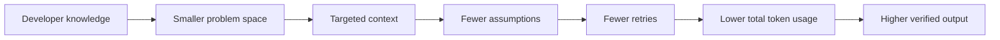

### The first connection

This single story connects the whole subject:

```text
Developer knowledge
        ↓
Better problem definition
        ↓
Better prompt
        ↓
Better context selection
        ↓
Better tool selection
        ↓
Less exploration
        ↓
Less token waste
        ↓
Fewer failures
        ↓
Cheaper verification
        ↓
Better AI-assisted engineering
```

Everything else in this playbook explains one part of that chain.

</details>

[⬆ Back to Navigate](#-navigate--click-any-topic-to-jump-there)

---

## 1. 🧭 The Learning Thesis — Dependency Order

<details open>
<summary><strong>Click to collapse/expand</strong></summary>

This guide turns the playbook into a sequence of concepts, experiments, and projects. The objective is to understand **why** token-efficient and reliable agentic workflows work — not merely copy prompts.

You should learn this subject in dependency order:

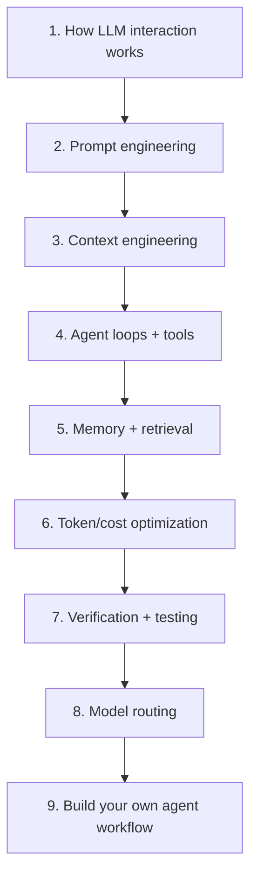

The order matters.

For example, studying MCP before understanding context is incomplete. You may learn how to connect tools without understanding why tool schemas and tool outputs consume context.

Likewise, studying model routing before understanding retries is incomplete. A cheaper model that fails repeatedly may have a higher **task cost** than a stronger model.

</details>

[⬆ Back to Navigate](#-navigate--click-any-topic-to-jump-there)

---

## 2. 🗺️ The Complete System Map

<details open>
<summary><strong>Click to collapse/expand</strong></summary>

Before studying individual tools, understand the complete pipeline.

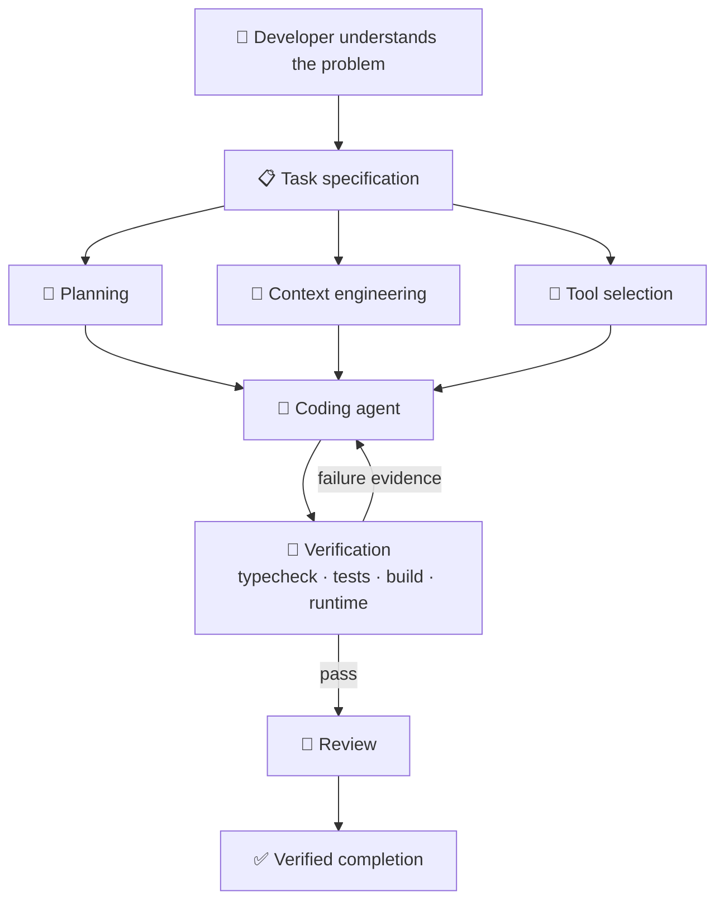

### How to read this diagram

The diagram is deliberately ordered.

1. **Developer knowledge comes first.** AI cannot reliably compensate for an undefined problem.
2. **Task specification converts human intent into explicit constraints.**
3. **Planning reduces unnecessary branching.**
4. **Context engineering decides what information the model receives.**
5. **Tool selection decides what the agent can observe and change.**
6. **The agent performs implementation.**
7. **Verification replaces self-confidence with evidence.**
8. **Review checks for mistakes that the implementation loop missed.**

The important lesson is:

> A model is only one component. Real agent performance depends on the model, context, tools, environment, feedback loop, and verification harness.

</details>

[⬆ Back to Navigate](#-navigate--click-any-topic-to-jump-there)

---

## 3. 🧠 Module 1 — Mental Model of an LLM

<details>
<summary><strong>Click to expand</strong></summary>

### Learn

- tokens
- context window
- input vs. output tokens
- system instructions
- tool calling
- reasoning/thinking where exposed
- latency
- caching
- why long context is not free

### Key experiment

Take one coding task and solve it three ways:

1. vague prompt
2. detailed prompt
3. targeted context + verification criteria

Record:

```text
Input tokens
Output tokens
Number of iterations
Number of failures
Time taken
Files changed
Whether verification passed
```

### Learning objective

Understand:

> Prompt quality affects token usage mainly by changing the model's search space and retry rate.

</details>

[⬆ Back to Navigate](#-navigate--click-any-topic-to-jump-there)

---

## 4. 🧩 Prompt Engineering Is Not the Same as Context Engineering

<details open>
<summary><strong>Click to collapse/expand</strong></summary>

### Prompt engineering

Prompt engineering focuses on instructions.

```text
What should the model do?
What output format is required?
What constraints apply?
```

### Context engineering

Context engineering asks:

```text
What information should the model receive right now?
What should be retrieved?
What should be summarized?
What should be excluded?
What must remain persistent?
```

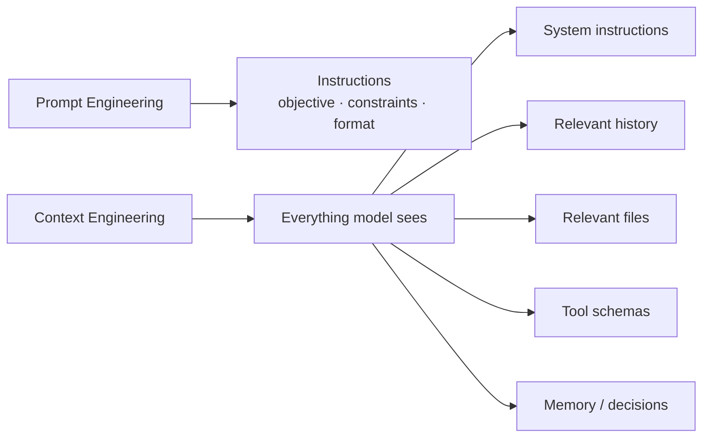

### Why this matters for token optimization

A perfect instruction can still fail if the model is missing a critical file.

A huge context can still fail if the important fact is buried under irrelevant information.

Therefore:

> **The best context is not the largest context. It is the smallest sufficient context that preserves the information needed to make the next correct decision.**

</details>

[⬆ Back to Navigate](#-navigate--click-any-topic-to-jump-there)

---

## 5. 💸 How Tokens Actually Become Expensive

<details open>
<summary><strong>Click to collapse/expand</strong></summary>

A user sees one prompt and one answer. An agent often sees much more.

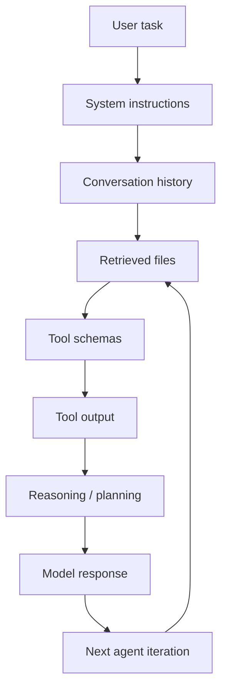

The total cost of an agentic task can include:

```text
Input tokens
+ output tokens
+ reasoning tokens where applicable
+ repeated context
+ file contents
+ tool definitions
+ tool results
+ retries
+ failed attempts
```

### The central optimization mistake

Do **not** optimize for:

```text
Fewest tokens in one prompt
```

Optimize for:

```text
Lowest total cost to reach a verified result
```

A 300-token prompt that causes ten failed iterations is worse than a 1,000-token prompt that enables one correct implementation.

</details>

[⬆ Back to Navigate](#-navigate--click-any-topic-to-jump-there)

---

## 6. 🧱 The Six-Layer Prompt — Module 2: Prompt Engineering

<details open>
<summary><strong>Click to collapse/expand</strong></summary>

Use this structure for substantial coding tasks.

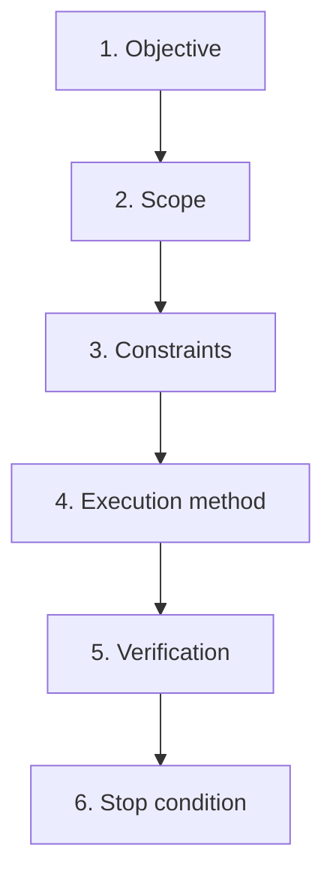

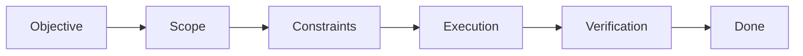

### 1. Objective

What must become true?

```text
Implement password reset for existing users.
```

### 2. Scope

Where should the agent look first?

```text
Start with src/auth, user model, existing email service, and auth tests.
```

### 3. Constraints

What must not change?

```text
Preserve the existing session architecture.
Do not introduce a new auth framework.
Do not modify unrelated login flows.
```

### 4. Execution

How should it proceed?

```text
Inspect existing patterns first.
Write a concise plan.
Implement the smallest coherent change.
```

### 5. Verification

How is success measured?

```text
Run typecheck.
Run targeted auth tests.
Run integration tests if affected.
Run production build.
Verify the reset flow manually or through E2E testing.
```

### 6. Stop condition

When should the agent stop?

```text
Stop after acceptance criteria pass.
Do not perform unrelated cleanup or speculative improvements.
```

<details>
<summary><strong>✏️ Exercise (from the Study Guide) — click to expand</strong></summary>

Take this vague request:

```text
Fix authentication.
```

Rewrite it into:

```text
Objective:
Expected behavior:
Relevant area:
Constraints:
Execution:
Verification:
Stop condition:
```

Do this for **five real bugs**.

**Mastery test:** you should be able to convert:

> "Make this production ready."

into measurable engineering requirements.

</details>

</details>

[⬆ Back to Navigate](#-navigate--click-any-topic-to-jump-there)

---

## 7. ✅ Small Prompting Habits That Save Large Amounts of Work

<details open>
<summary><strong>Click to collapse/expand</strong></summary>

### Replace adjectives with observable criteria

Bad:

```text
Make it production-ready.
Make it clean and scalable.
```

Better:

```text
- Typecheck passes.
- Lint passes.
- Existing tests remain green.
- New failure paths are handled.
- Production build succeeds.
- No unrelated files are modified.
```

### Avoid repeated instructions

This:

```text
Be careful.
Use best practices.
Make it high quality.
Do it properly.
Make it production level.
```

does not necessarily create five independent safeguards.

Replace it with actual constraints.

### Give a hypothesis when you have one

```text
The failure appears related to upload middleware.
Inspect that assumption before changing other modules.
```

This reduces exploration while still allowing the model to reject a wrong hypothesis.

</details>

[⬆ Back to Navigate](#-navigate--click-any-topic-to-jump-there)

---

## 8. 🔎 Progressive Context Expansion

<details open>
<summary><strong>Click to collapse/expand</strong></summary>

The common wasteful instruction is:

```text
Read the entire repository first.
```

A better approach is:

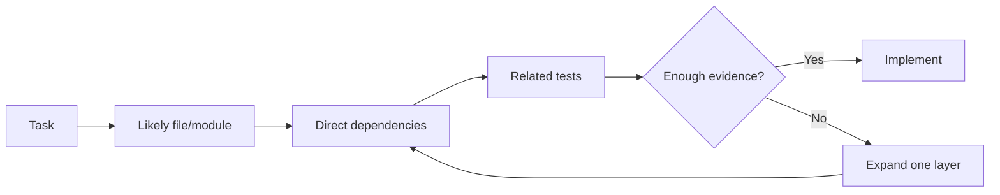

### Why this works

Most bugs and features have a locality structure. The relevant information is usually concentrated in:

- the target module
- its imports
- its callers
- related tests
- relevant configuration

Full-repository context should be an **escalation step**, not the default.

</details>

[⬆ Back to Navigate](#-navigate--click-any-topic-to-jump-there)

---

## 9. 🧠 Why AI "Forgets" Context — Module 3: Context Engineering

<details open>
<summary><strong>Click to collapse/expand</strong></summary>

The phrase "the model forgot" describes several different failures.

| Failure | What is happening | Better design |
|---|---|---|
| Context overflow | Important information is pushed out or compressed | Checkpoint and compact |
| Context dilution | Important facts are buried in noise | Retrieve selectively |
| Decision drift | Agent silently changes a previous choice | Maintain locked decisions |
| Task drift | Current objective becomes unclear | Keep explicit working state |
| Retrieval failure | Correct information exists but was not retrieved | Improve search/indexing |
| Stale memory | Old facts override newer facts | Version and timestamp facts |

### The three-tier context architecture

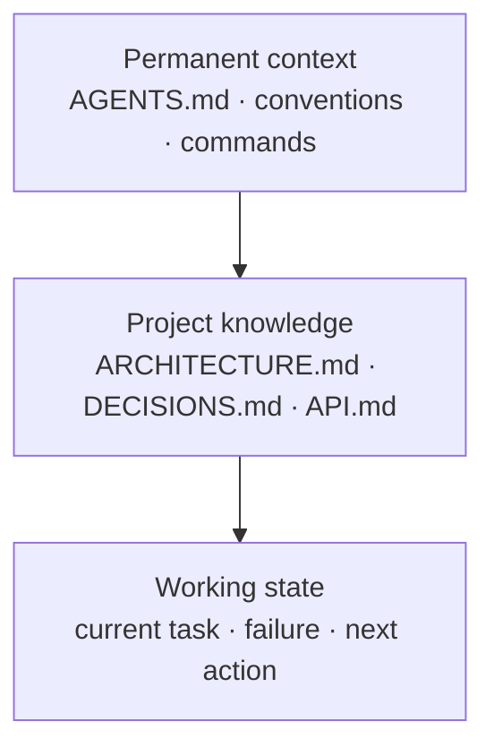

**Tier 1 — Permanent context** (rarely changes):
```text
Tech stack
Coding conventions
Commands
Security rules
Repository layout
```

**Tier 2 — Project knowledge** (changes occasionally):
```text
Architecture
Database decisions
API contracts
Important trade-offs
```

**Tier 3 — Working state** (changes continuously):
```json
{
  "goal": "Implement OAuth callback",
  "current_subtask": "Fix production redirect URI",
  "status": "debugging",
  "relevant_files": [
    "src/auth/callback.ts",
    "src/config/auth.ts"
  ],
  "last_result": "401 invalid redirect URI",
  "next_action": "Compare production configuration",
  "blockers": []
}
```

This structure prevents one giant conversation from becoming the only memory system.

<details>
<summary><strong>🧪 Build + Experiment (from the Study Guide) — click to expand</strong></summary>

**Learn:** retrieval · selective context · progressive expansion · context dilution · compaction · stable vs. volatile knowledge · decision logs · working memory

**Build** these files in a small project:

```text
AGENTS.md
ARCHITECTURE.md
DECISIONS.md
PROJECT_STATE.md
```

**Experiment:** ask an agent to solve a task two ways.

- **Run A** — give it the whole repository context.
- **Run B** — give it only: `AGENTS.md`, the relevant module, direct dependencies, a related test, and current state.

Compare:

```text
Tokens
Latency
Correctness
Retries
Unrelated changes
```

</details>

</details>

[⬆ Back to Navigate](#-navigate--click-any-topic-to-jump-there)

---

## 10. 🗜️ Compaction — Module 6: Memory and "AI Forgot"

<details open>
<summary><strong>Click to collapse/expand</strong></summary>

Compaction does **not** mean randomly shortening history.

It means converting expensive raw history into durable facts.

**Before:**

```text
20,000 tokens of:
- tool output
- failed attempts
- logs
- discussion
```

**After:**

```text
GOAL:
Fix production OAuth callback.

CONFIRMED:
- Local works.
- Production fails with invalid redirect URI.

LOCKED DECISION:
Keep current auth provider and JWT architecture.

FILES:
src/auth/callback.ts
src/config/auth.ts

NEXT ACTION:
Compare deployed redirect URI against provider configuration.
```

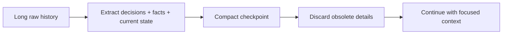

A good checkpoint is a **lossy compression algorithm for agent state**: discard noise, preserve information required for the next decision.

<details>
<summary><strong>🧪 Build a Checkpoint Format + Experiment (from the Study Guide) — click to expand</strong></summary>

Study three levels:

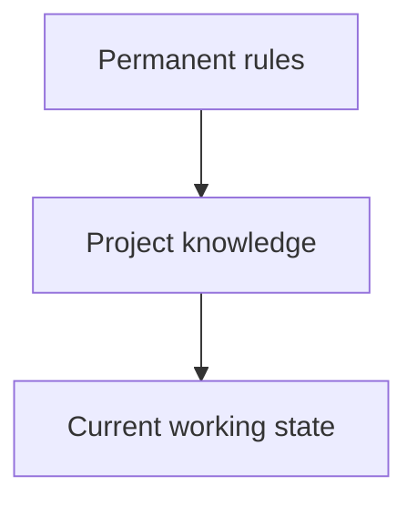

**Build a checkpoint format:**

```text
GOAL:
CURRENT SUBTASK:
LOCKED DECISIONS:
MODIFIED FILES:
LAST VERIFIED RESULT:
CURRENT FAILURE:
NEXT ACTION:
```

**Experiment:** run a long task, intentionally clear the active conversation, then restore work from the checkpoint.

> If the agent can continue accurately, the memory design is working.

</details>

</details>

[⬆ Back to Navigate](#-navigate--click-any-topic-to-jump-there)

---

## 11. 🔌 MCP and Token Efficiency — Module 5: MCP and Tool Design

<details open>
<summary><strong>Click to collapse/expand</strong></summary>

MCP gives an agent a standard way to access external capabilities.

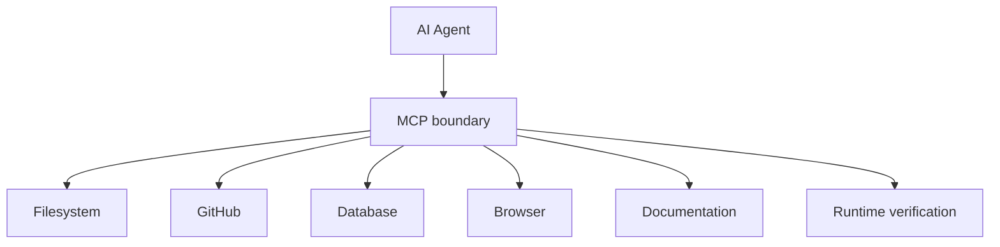

### Important correction

MCP does not automatically reduce tokens.

A badly designed MCP server can increase usage because:

- every tool schema consumes context
- too many tools increase selection complexity
- large tool results get injected back into context
- broad endpoints dump unnecessary data

Good tool design is narrow and composable.

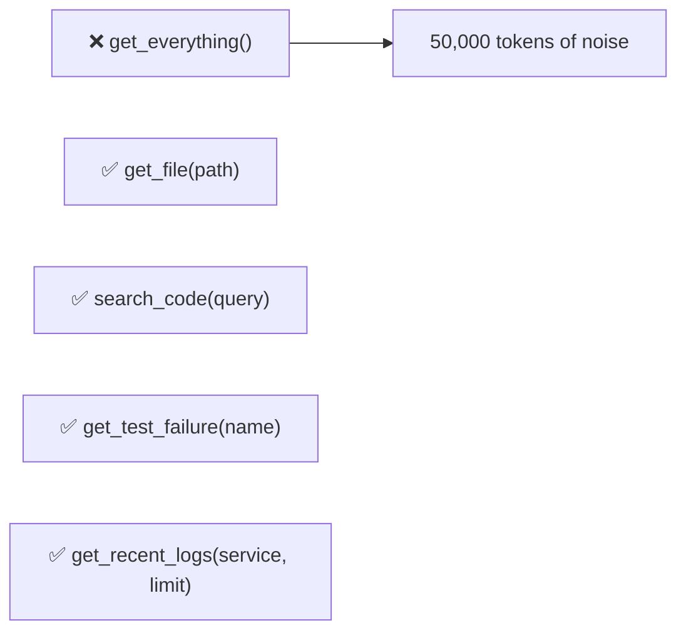

### Design principle

> **A tool should return the smallest useful answer for the decision currently being made.**

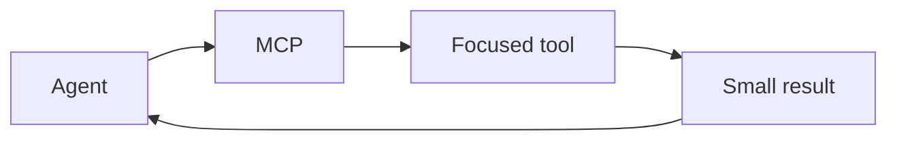

<details>
<summary><strong>🧪 Build or Inspect a Simple MCP Tool (from the Study Guide) — click to expand</strong></summary>

Design these:

```text
search_code(query)
get_file(path)
get_test_failure(test_name)
get_recent_logs(service, limit)
```

Then compare with:

```text
get_everything()
```

Ask:

- What context is consumed by the schema?
- How large is the result?
- Is the output reusable?
- Does the tool help the next decision?

**Mastery principle:**

> Tool design is context design.

</details>

</details>

[⬆ Back to Navigate](#-navigate--click-any-topic-to-jump-there)

---

## 12. 🔁 The Agentic Coding Loop — Module 4: Agentic Coding

<details open>
<summary><strong>Click to collapse/expand</strong></summary>

An autonomous coding agent is not just "a chatbot that writes files."

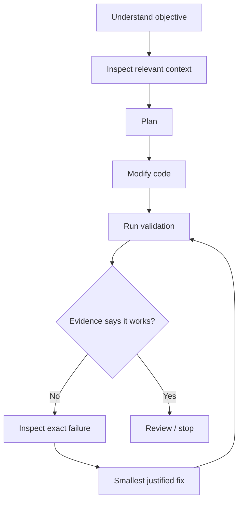

Compare with the general agent loop:

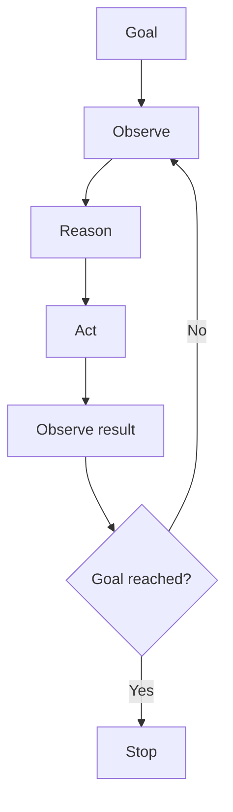

### The key change: external verification

The model should not be the final judge of whether its own output works.

Use:

- compiler/typechecker
- linter
- unit tests
- integration tests
- E2E tests
- production build
- runtime/browser checks
- security tests where authorized

This is the conceptual role of a Ralph-style loop and runtime verification systems such as Reticle.

<details>
<summary><strong>🧪 Exercise (from the Study Guide) — click to expand</strong></summary>

Study:

- planning
- tool selection
- environment interaction
- state
- recursion limits
- stop conditions
- failure recovery

Use a coding agent on a deliberately small project.

Give it a bug with:

```text
clear reproduction
acceptance criteria
relevant files
verification command
```

Then remove those constraints and observe the difference.

</details>

</details>

[⬆ Back to Navigate](#-navigate--click-any-topic-to-jump-there)

---

## 13. 🧪 Verification as a Cost-Control Mechanism — Module 8: Verification

<details open>
<summary><strong>Click to collapse/expand</strong></summary>

Testing does not only improve quality. It reduces agent wandering.

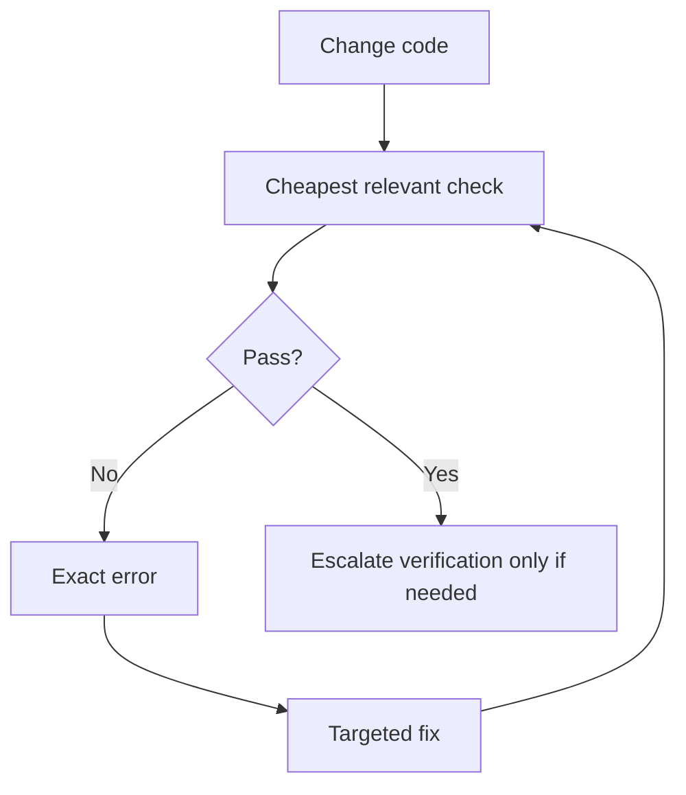

Study testing as an information system for agents:

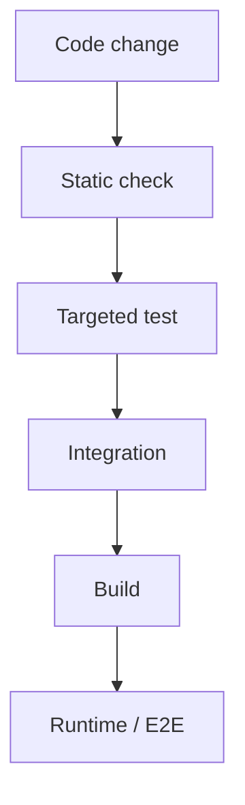

### Practical validation order

```text
1. Typecheck / compile
2. Lint
3. Targeted unit test
4. Relevant integration test
5. Full suite when justified
6. Production build
7. Runtime / E2E verification
```

Do not mechanically run everything after every one-line edit. Match validation cost to risk.

<details>
<summary><strong>🧪 Build a Verification Ladder (from the Study Guide) — click to expand</strong></summary>

For one project, define:

```text
npm run typecheck
npm run lint
npm test -- affected-suite
npm run test:integration
npm run build
npm run test:e2e
```

Teach the agent to run the smallest relevant check first.

</details>

</details>

[⬆ Back to Navigate](#-navigate--click-any-topic-to-jump-there)

---

## 14. 🛑 The Two-Failure Rule

<details open>
<summary><strong>Click to collapse/expand</strong></summary>

Repeatedly patching the same failure is a common source of runaway token usage.

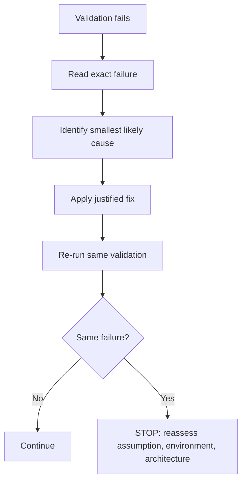

After two similar failures, ask:

```text
Is the hypothesis wrong?
Is the environment wrong?
Is configuration missing?
Is the test invalid?
Is the architecture assumption incorrect?
```

The purpose is to break the expensive pattern:

```text
guess → patch → fail → guess → patch → fail
```

</details>

[⬆ Back to Navigate](#-navigate--click-any-topic-to-jump-there)

---

## 15. 🎛️ Model Routing — Module 9: The Model Landscape

<details open>
<summary><strong>Click to collapse/expand</strong></summary>

Use the cheapest model that can reliably do the next step.

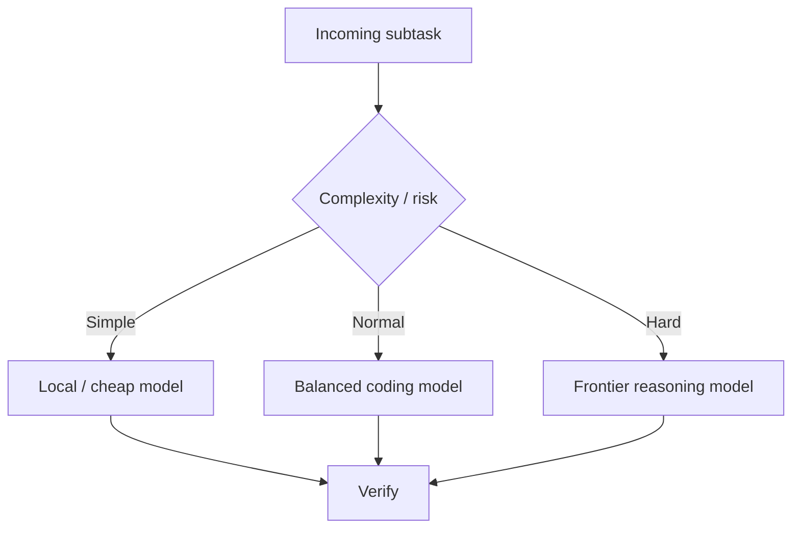

### Cheap/local tier
```text
Classification
Summarization
Code search
Log extraction
Simple transformations
Embeddings
```

### Balanced tier
```text
Normal feature work
Multi-file refactoring
Test writing
Debugging
```

### Frontier tier
```text
Complex architecture
Difficult production debugging
Large dependency chains
High-risk reasoning
```

The best metric is not price per million tokens. It is:

> **Cost per verified successful task.**

A stronger model may use fewer total tokens if it avoids four failed attempts.

<details>
<summary><strong>🧪 Model Landscape Categories + Benchmark Habit (from the Study Guide) — click to expand</strong></summary>

Do not memorize rankings permanently. Models change quickly. Learn categories instead:

```mermaid
mindmap
  root((AI Models))
    Frontier
      Hard reasoning
      Architecture
    Balanced
      Everyday coding
    Fast/Cheap
      Search
      Summaries
      Routing
    Open/Local
      Privacy
      Customization
      Cost control
```

Study model selection using:

```text
Task complexity
Risk
Context requirements
Latency
Cost
Tool capability
Reliability on your workload
```

**Important research habit:** maintain a benchmark notebook. Do not blindly trust public leaderboards. Test models on:

- your codebase
- your language
- your framework
- your failure patterns
- your verification harness

</details>

</details>

[⬆ Back to Navigate](#-navigate--click-any-topic-to-jump-there)

---

## 16. 🧠 Why Developer Knowledge Is a Context Compressor — Module 10: Developer Knowledge

<details open>
<summary><strong>Click to collapse/expand</strong></summary>

A developer who understands authentication can say:

```text
Existing architecture uses JWT access + refresh tokens.
Implement password reset without changing session management.
```

A developer without that knowledge may ask:

```text
Build secure authentication.
Analyze everything and choose the best approach.
```

The first prompt contains less uncertainty.

```mermaid
flowchart TD
    A["Domain knowledge"] --> B["Problem classification"]
    B --> C["Known solution space"]
    C --> D["Targeted question"]
    D --> E["Smaller context"]
    E --> F["Less AI exploration"]
```

This is why studying good repositories and established architectures reduces AI dependency.

The goal is not memorizing repositories. Build a **mental library of problem classes and solution patterns**.

<details>
<summary><strong>🧪 Build the Mental Library (from the Study Guide) — click to expand</strong></summary>

Build a mental library around:

```text
Authentication
Authorization
Databases
Caching
Queues
API design
Testing
Security
Observability
Deployment
```

For each topic, learn:

```text
What problem does it solve?
What are common patterns?
What are the trade-offs?
How is it tested?
What usually fails?
```

> The better you classify a problem, the less you need an AI agent to explore.

</details>

</details>

[⬆ Back to Navigate](#-navigate--click-any-topic-to-jump-there)

---

## 17. 🪜 Anti-Vibe-Coding Escalation Ladder

<details open>
<summary><strong>Click to collapse/expand</strong></summary>

```mermaid
flowchart TD
    L0["0. You know it → implement directly"]
    L1["1. Official documentation"]
    L2["2. Repository/code search"]
    L3["3. Trusted reference implementation"]
    L4["4. Targeted AI assistance"]
    L5["5. Coding agent"]
    L6["6. Autonomous agent loop"]
    L0 --> L1 --> L2 --> L3 --> L4 --> L5 --> L6
```

Do not jump to the highest automation level by default.

Use the minimum amount of AI autonomy needed to solve the problem efficiently.

</details>

[⬆ Back to Navigate](#-navigate--click-any-topic-to-jump-there)

---

## 18. ❓ The Five-Question Gate

<details open>
<summary><strong>Click to collapse/expand</strong></summary>

Before giving a substantial task to an agent:

```mermaid
flowchart TD
    Q1{"What is the exact problem?"} --> Q2{"What should happen instead?"}
    Q2 --> Q3{"Where is the likely affected area?"}
    Q3 --> Q4{"What approach is preferred or forbidden?"}
    Q4 --> Q5{"How will success be verified?"}
    Q5 --> A["Now invoke the agent"]
```

If you cannot answer one question, that missing knowledge often indicates where to investigate first.

</details>

[⬆ Back to Navigate](#-navigate--click-any-topic-to-jump-there)

---

## 19. 🧰 Tool Ecosystem: Where Each Tool Fits

<details open>
<summary><strong>Click to collapse/expand</strong></summary>

```mermaid
mindmap
  root((AI Engineering))
    Planning
      GSD-style task decomposition
    Execution
      Coding agents
      Cline
      Roo Code
      Cursor
      Claude Code
    Memory
      AGENTS.md
      Decision logs
      Graph memory
    Tools
      MCP
      Filesystem
      Browser
      Terminal
    Verification
      Tests
      Build
      Runtime checks
      Reticle
    Review
      CodeRabbit
    Local AI
      Ollama
      Open models
```

The important connection is:

```text
Planning reduces ambiguity.
Context reduces missing information.
Tools reduce guessing.
Agents perform work.
Verification produces evidence.
Review provides a second perspective.
Memory prevents repeated rediscovery.
```

No single tool replaces the entire system.

</details>

[⬆ Back to Navigate](#-navigate--click-any-topic-to-jump-there)

---

## 20. 🛡️ Security Testing in an Agentic Workflow

<details open>
<summary><strong>Click to collapse/expand</strong></summary>

Only test systems you own or are explicitly authorized to assess.

```mermaid
flowchart TD
    A["Understand application"] --> B["Define scope + rules"]
    B --> C["Run targeted assessment"]
    C --> D["Validate finding"]
    D --> E["Understand root cause"]
    E --> F["Minimal fix"]
    F --> G["Run regression tests"]
    G --> H["Retest"]
    H --> I["Production validation"]
```

Security agents should receive explicit scope. "Test everything" creates unnecessary work and risk.

A good scope identifies:

```text
Authorized target
Allowed environment
Relevant attack surface
Excluded systems
Desired evidence
Stop conditions
```

</details>

[⬆ Back to Navigate](#-navigate--click-any-topic-to-jump-there)

---

## 21. 🐛 Common Bugs in AI-Assisted Engineering

<details open>
<summary><strong>Click to collapse/expand</strong></summary>

| # | Bug | Symptom | Fix |
|---|---|---|---|
| 1 | **Context dump** | Agent reads everything | Progressive context expansion |
| 2 | **Instruction repetition** | Huge prompt with repeated "best practice" language | Replace prose with measurable constraints |
| 3 | **Tool overload** | Dozens of MCP tools always available | Enable the smallest task-relevant tool set |
| 4 | **Conversation-only memory** | Important decisions disappear after compaction | Externalize stable knowledge and checkpoints |
| 5 | **Agent judges itself** | "Done" without tests | Define external evidence |
| 6 | **Blind patching** | Agent repeatedly changes code after the same failure | Two-failure rule |
| 7 | **Always using the strongest model** | High cost for trivial work | Route by complexity and risk |
| 8 | **Always using the cheapest model** | Repeated retries consume more than one strong attempt | Measure verified task cost |

</details>

[⬆ Back to Navigate](#-navigate--click-any-topic-to-jump-there)

---

## 22. 📜 Master Instruction Template

<details open>
<summary><strong>Click to collapse/expand</strong></summary>

```text
# OBJECTIVE
State the concrete outcome.

# SCOPE
Start with the relevant modules/files.
Expand only when evidence requires it.

# CONSTRAINTS
List architecture that must be preserved.
List forbidden changes.

# DISCOVERY
Search for existing implementations and tests before creating new patterns.

# PLAN
Provide a concise plan:
- target files
- expected change
- validation per step

# EXECUTION
Make small, coherent changes.
Preserve project conventions.

# FAILURE HANDLING
Read the exact error.
Find the smallest likely cause.
Apply the smallest justified fix.
If the same failure persists twice, stop and reassess.

# CONTEXT MANAGEMENT
Preserve:
- objective
- acceptance criteria
- locked decisions
- modified files
- unresolved failures
- next action

Discard or summarize:
- resolved logs
- obsolete plans
- repetitive tool output

# TOOLS
Use only tools relevant to the current subtask.

# VALIDATION
Use the cheapest relevant check first:
typecheck → lint → targeted tests → integration → build → runtime.

# DEFINITION OF DONE
Acceptance criteria pass.
Relevant tests pass.
Build succeeds when applicable.
Report limitations honestly.
Do not make unrelated improvements.
```

</details>

[⬆ Back to Navigate](#-navigate--click-any-topic-to-jump-there)

---

## 23. 🧮 The Final Formula

<details open>
<summary><strong>Click to collapse/expand</strong></summary>

```mermaid
flowchart LR
    subgraph Efficient["✅ Efficient AI-Assisted Engineering"]
    A1[Developer knowledge] --> A2[Clear problem definition] --> A3[Targeted context] --> A4[Selective tools] --> A5[Appropriate model routing] --> A6[Persistent decisions] --> A7[External verification]
    end
```

```text
Developer knowledge
+ clear problem definition
+ targeted context
+ selective tools
+ appropriate model routing
+ persistent decisions
+ external verification
= efficient AI-assisted engineering
```

The opposite pattern is:

```mermaid
flowchart LR
    subgraph Fragile["❌ Expensive, Fragile Vibe Coding"]
    B1[Undefined problem] --> B2["'Build everything'"] --> B3[Full repository context] --> B4[Maximum autonomy] --> B5[No deterministic verification]
    end
```

```text
Undefined problem
+ "build everything"
+ full repository context
+ maximum autonomy
+ no deterministic verification
= expensive, fragile vibe coding
```

</details>

[⬆ Back to Navigate](#-navigate--click-any-topic-to-jump-there)

---

## 24. 📅 Practical Daily Workflow

<details open>
<summary><strong>Click to collapse/expand</strong></summary>

```mermaid
flowchart TD
    S1["1. Observe the problem"] --> S2["2. Reproduce it"]
    S2 --> S3["3. Read the error/log/test"]
    S3 --> S4["4. Form a hypothesis"]
    S4 --> S5["5. Identify smallest relevant context"]
    S5 --> S6["6. Define expected behavior"]
    S6 --> S7["7. Define verification before implementation"]
    S7 --> S8["8. Choose the appropriate model/agent"]
    S8 --> S9["9. Implement in small steps"]
    S9 --> S10["10. Run the cheapest relevant check"]
    S10 --> S11["11. Use failure evidence, not guesses"]
    S11 --> S12["12. Compact state when the task becomes long"]
    S12 --> S13["13. Stop when acceptance criteria are satisfied"]
```

> **The mature goal is not "make AI do everything." The goal is to build an engineering system in which AI performs high-leverage work while the developer controls problem definition, constraints, judgment, and verification.**

</details>

[⬆ Back to Navigate](#-navigate--click-any-topic-to-jump-there)

---

## 25. 🗓️ The 8-Week Hands-On Roadmap

<details open>
<summary><strong>Click to collapse/expand</strong></summary>

```mermaid
flowchart TD
    W1["Week 1 — Prompt fundamentals"] --> W2["Week 2 — Context engineering"]
    W2 --> W3["Week 3 — Agent loops"]
    W3 --> W4["Week 4 — MCP and tools"]
    W4 --> W5["Week 5 — Verification"]
    W5 --> W6["Week 6 — Local models"]
    W6 --> W7["Week 7 — Memory and compaction"]
    W7 --> W8["Week 8 — Capstone"]
```

### Week 1 — Prompt fundamentals
Study: `Tokens · Context · Instructions · Constraints · Acceptance criteria`
**Deliverable:** 10 before/after prompt rewrites

### Week 2 — Context engineering
Build: `AGENTS.md · ARCHITECTURE.md · DECISIONS.md · PROJECT_STATE.md`
**Deliverable:** A compact project context system.

### Week 3 — Agent loops
Use one coding agent. Study: `Plan · Act · Observe · Retry · Stop`
**Deliverable:** One small feature completed with recorded iterations.

### Week 4 — MCP and tools
Install or inspect a few relevant tools.
**Deliverable:** A minimal task-specific tool set.

### Week 5 — Verification
Add: `Typechecking · Linting · Unit tests · Build verification`
**Deliverable:** An explicit verification ladder.

### Week 6 — Local models
Experiment with Ollama or another local runtime. Compare: `Local model vs. cheap API model vs. frontier model` — using the same small task.

### Week 7 — Memory and compaction
Run a long task and create checkpoints.
**Deliverable:** A reusable compaction template.

### Week 8 — Capstone
Build a complete workflow:

```mermaid
flowchart TD
    A["Task"] --> B["Five-question gate"]
    B --> C["Context retrieval"]
    C --> D["Model routing"]
    D --> E["Coding agent"]
    E --> F["Verification"]
    F -->|Fail| G["Evidence-based repair"]
    G --> E
    F -->|Pass| H["Review"]
    H --> I["Checkpoint + Done"]
```

</details>

[⬆ Back to Navigate](#-navigate--click-any-topic-to-jump-there)

---

## 26. 🔬 Research Questions to Explore

<details open>
<summary><strong>Click to collapse/expand</strong></summary>

Use these questions as a research notebook:

1. Does a stronger model reduce total retries?
2. How much context is actually required for a correct fix?
3. Does repository indexing improve or worsen precision?
4. What tool outputs create the most context waste?
5. When does summarization remove critical details?
6. How should decisions be versioned?
7. What validation gives the highest information per unit of time?
8. When should an agent stop expanding its search?
9. When is a local model sufficient?
10. How should cost be measured: per token or per verified task?

</details>

[⬆ Back to Navigate](#-navigate--click-any-topic-to-jump-there)

---

## 27. 🧭 Final Study Model

<details open>
<summary><strong>Click to collapse/expand</strong></summary>

```mermaid
flowchart TD
    A["Understand the software"] --> B["Define the problem"]
    B --> C["Define expected behavior"]
    C --> D["Select the minimum useful context"]
    D --> E["Select the minimum useful tools"]
    E --> F["Select the appropriate model"]
    F --> G["Implement in bounded steps"]
    G --> H["Verify externally"]
    H --> I["Preserve useful state"]
    I --> J["Learn from failures"]
```

### Final principle

> **AI optimization is ultimately an information-management problem.**

```text
Prompting          controls instructions.
Context engineering controls information.
MCP                controls access to information and actions.
Memory             controls persistence.
Model routing      controls compute cost.
Testing            controls correctness.
Developer knowledge controls the size of the problem space.
```

Together, these form a complete AI-assisted engineering system.

</details>

[⬆ Back to Navigate](#-navigate--click-any-topic-to-jump-there)

---

<div align="center">

*Merged from the AI Engineering Playbook and the Optimizing AI Usage & Prompting Study Guide into one living reference document.*

[⬆ Back to top](#-ai-engineering-playbook)

</div>
