<div align="center">

# 🧭 AI Engineering Playbook

### Prompting · Context Engineering · Token Optimization · The Model Landscape


> *"The goal is not the shortest prompt. The goal is the least total cost to reach a verified result."*

</div>

---

## 🗺️ Navigate

> Click any topic to jump straight there.

| # | Section | What's inside |
|---|---|---|
| 0 | [🌐 System Map](#0-system-map) | The whole pipeline, one diagram |
| 1 | [🧩 The Modern AI Dev Ecosystem](#1--the-modern-ai-dev-ecosystem) | Reticle · GSD · Ralph Loop · CodeRabbit · Graphiti · MCP · Ollama · Cline/Roo |
| 2 | [⚙️ Token Optimization Framework](#2--the-token-optimization-framework) | Prompt structure, context tiers, verification pyramid |
| 3 | [🛡️ Security, Knowledge & Anti-Vibe-Coding](#3--security-testing-developer-knowledge--anti-vibe-coding) | Strix, escalation ladder, the 5-question gate |
| 4 | [🤖 The AI Model Landscape](#4--the-ai-model-landscape) | GPT · Claude · Gemini · Grok · DeepSeek · hardware |
| 5 | [✅ Master Cheat Sheet](#5--master-cheat-sheet) | Checklist you can actually use |
| 6 | [🎓 Learning Path](#6--recommended-learning-path) | What to build, in order |
| 7 | [🔗 Reference Links](#7--reference-links) | Every repo/doc mentioned |

---

## 0. System Map

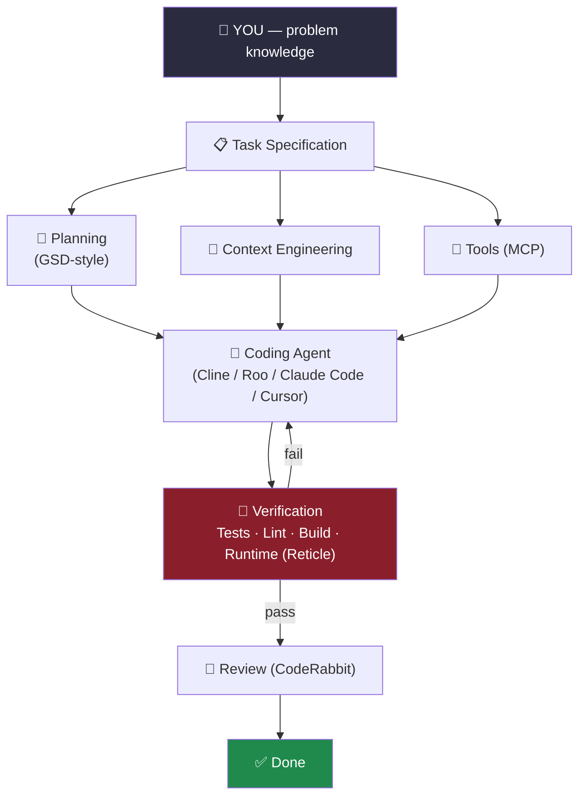

**Core principle behind every section below:**

> Prompting isn't "writing instructions." It's **context engineering** — deciding *what* the model receives, *when*, and *how much*.

---

## 1. 🧩 The Modern AI Dev Ecosystem

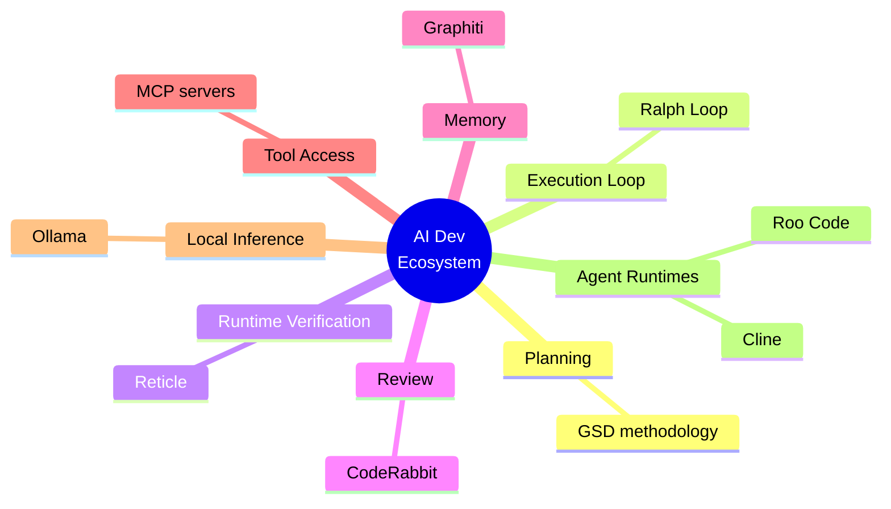

<details>
<summary><strong>🔍 1.1 — Reticle: Runtime Verification for AI Agents</strong> (click to expand)</summary>

**The problem:** an agent reads its own diff, declares "done" — but a diff is not proof the app runs.

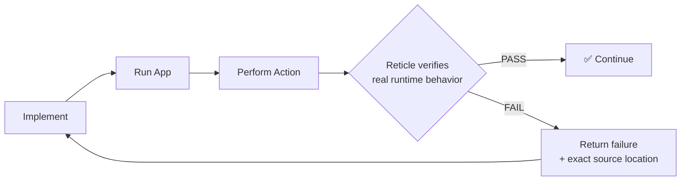

Reticle exposes network requests, console errors, DOM/route state, and framework signals via MCP — so the agent fixes only what's *actually* broken.

🔗 [Reticle on GitHub](https://github.com/reticlehq/reticle)
</details>

<details>
<summary><strong>📋 1.2 — GSD ("Get Shit Done"): Phased-Task Philosophy</strong></summary>

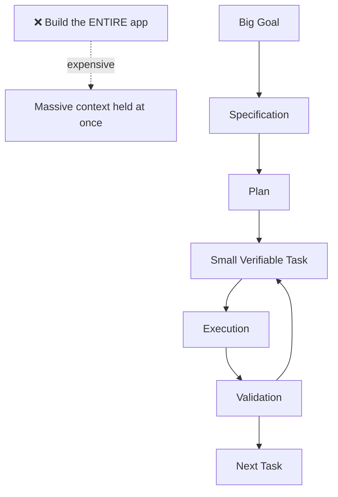

A phased system retrieves only what's needed for the *current* task — instead of holding architecture + requirements + files + history simultaneously.
</details>

<details>
<summary><strong>🔄 1.3 — The Ralph Loop: Externally-Verified Iteration</strong></summary>

> **The AI should never decide, by itself, whether it succeeded.**

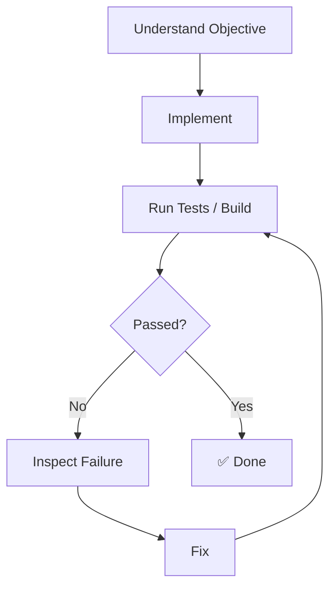

**Ralph + Reticle combined:** Agent implements → Reticle checks the *running* app → failure + evidence → agent fixes → repeat.
</details>

<details>
<summary><strong>🐰 1.4 — CodeRabbit: AI as the Review Layer</strong></summary>

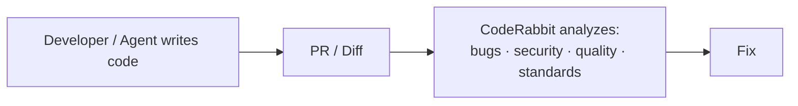

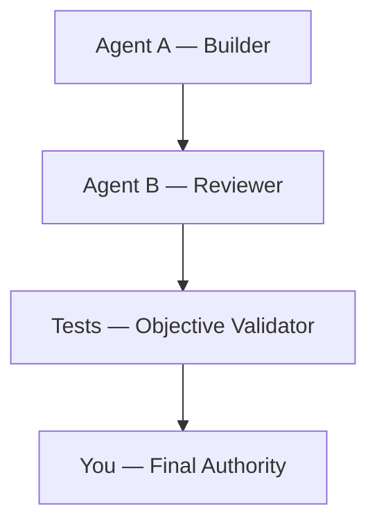

🔗 [CodeRabbit Docs](https://docs.coderabbit.ai/)
</details>

<details>
<summary><strong>🧵 1.5 — Graphiti: Temporal Knowledge-Graph Memory</strong></summary>

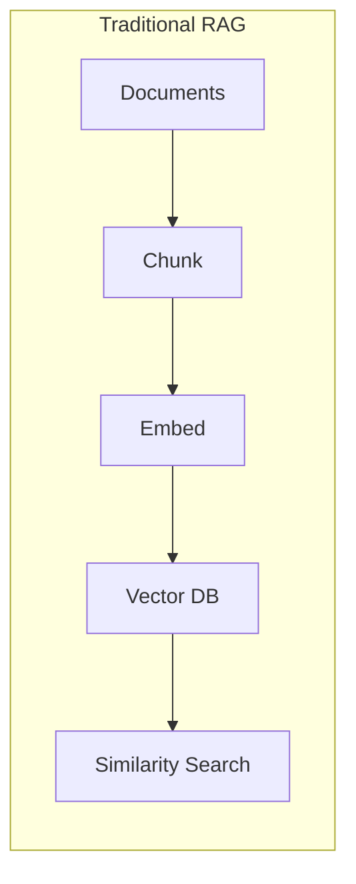

```mermaid
timeline
    title Facts Change Over Time — Graphiti tracks WHEN
    January : Database = MongoDB
    March   : Database = PostgreSQL
    June    : Database = Supabase
```

| Approach | Context sent |
|---|---|
| Dump entire project history | ~500,000 tokens |
| Graphiti — retrieve only relevant facts | ~3,000 tokens |

🔗 [Graphiti on GitHub](https://github.com/getzep/graphiti)
</details>

<details>
<summary><strong>🧩 1.6 — Prompt Engineering vs. Context Engineering</strong></summary>

| | Prompt Engineering | Context Engineering |
|---|---|---|
| Focus | Instructions, roles, formats | *Everything* the model sees |
| Scope | One message | System prompt + history + files + tools + memory |
| Key question | "How do I phrase this?" | "What should the model receive **right now**?" |

> Prompt engineering = writing good instructions for an employee.
> Context engineering = giving them the right files, tools, and history — without burying them in noise.
</details>

<details>
<summary><strong>🔌 1.7 — MCP: Model Context Protocol</strong></summary>

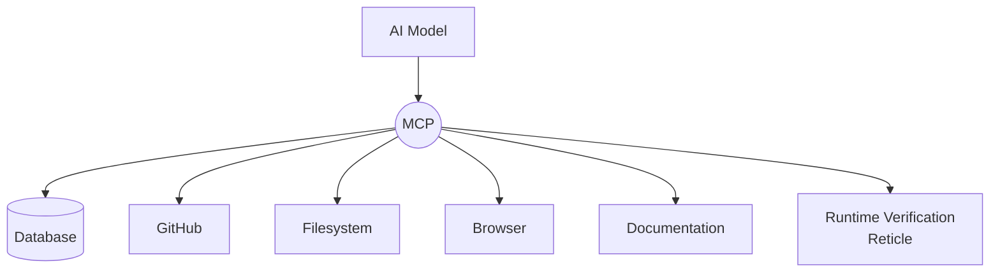

> ⚠️ More tools ≠ smarter agent. 50 tools when 3 are needed → tool-selection confusion + wasted context on unused schemas.

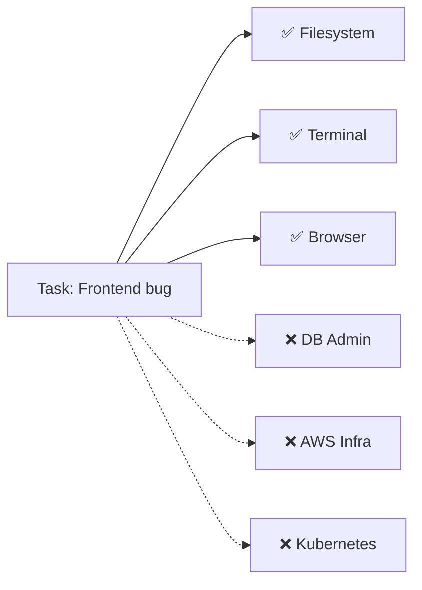
</details>

<details>
<summary><strong>🦙 1.8 — Ollama: Local & Open Models</strong></summary>

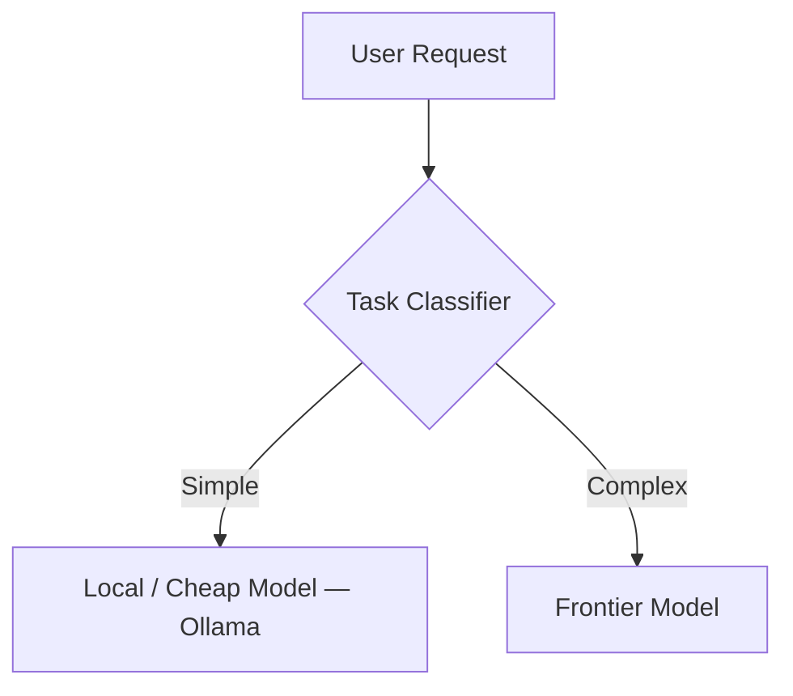

Route: classification, summarization, embeddings → local. Architecture, hard debugging → frontier.

🔗 [Ollama on GitHub](https://github.com/ollama/ollama)
</details>

<details>
<summary><strong>🤖 1.9 — Cline & Roo Code: Open-Source Autonomous Agents</strong></summary>

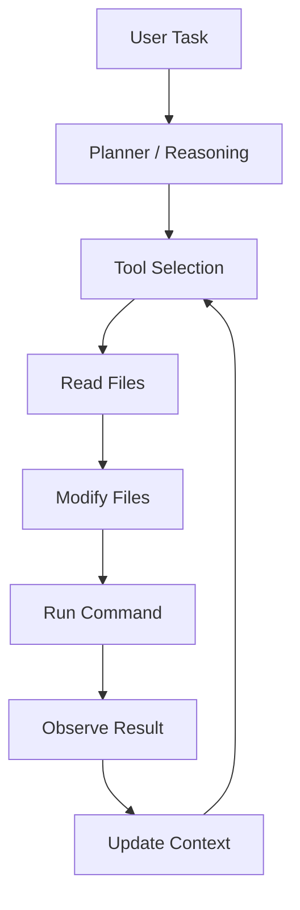

🔗 [Cline](https://github.com/cline/cline) · [Roo Code](https://github.com/samhvw8/Roo-Cline)
</details>

<details>
<summary><strong>🏗️ 1.10 — Full Modern Architecture (assembled)</strong></summary>

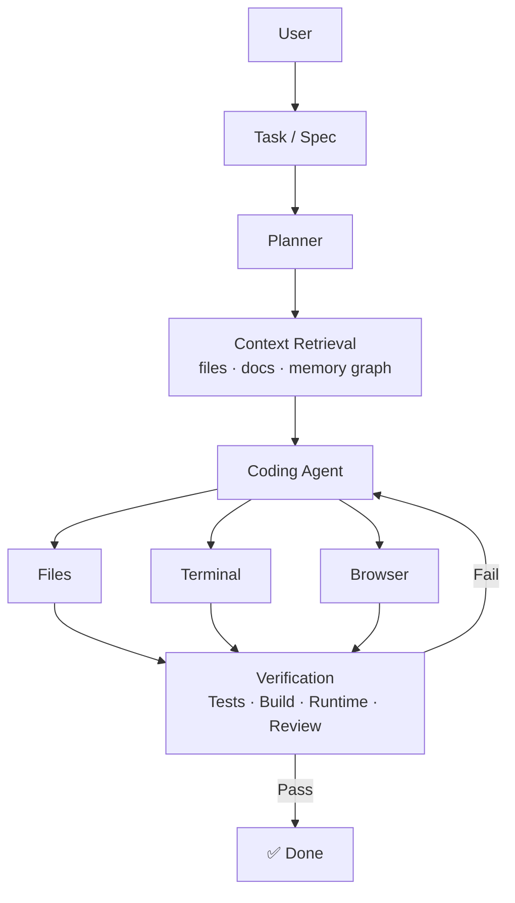

**Old workflow:** `Prompt → Answer`
**New workflow:** `Prompt → Agent → Tools → Environment → Feedback → Verification → Updated Context → Agent…`
</details>

[⬆ Back to Navigate](#-navigate)

---

## 2. ⚙️ The Token Optimization Framework

> **Optimization target:** Maximum verified work per token = correct implementation + right context + targeted tools + automated verification **−** wasted exploration & retries.

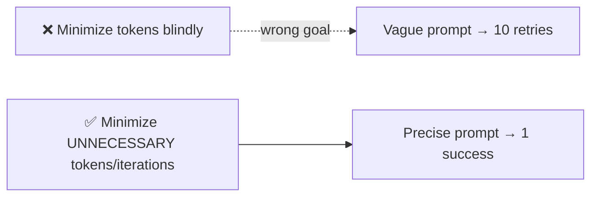

<details>
<summary><strong>✅ 2.1 — Small Habits That Save Real Tokens</strong></summary>

- **Say it once, clearly.** Repeating "be careful / do it well / best practices" five ways adds tokens, not clarity.
- **Replace vague adjectives with measurable conditions:**

| ❌ Vague | ✅ Measurable |
|---|---|
| "Make it production ready" | "Typecheck passes · lint passes · tests pass · build succeeds · errors handled" |

- **Don't request a full-repo read** — use progressive context expansion:

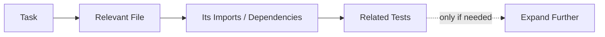
</details>

<details>
<summary><strong>🧱 2.2 — The Six-Layer Prompt Structure</strong></summary>

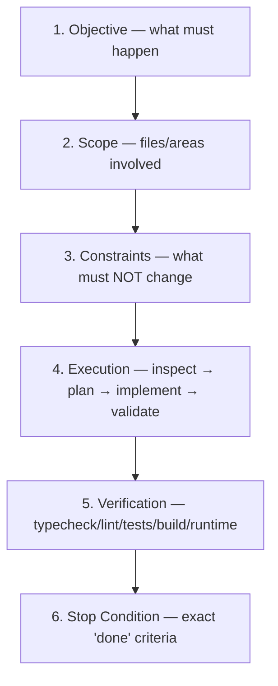

> Add explicitly: *"Do not continue making unrelated improvements after completion."* Prevents "Oh, I also noticed…" scope creep.
</details>

<details>
<summary><strong>🪜 2.3 — Plan Once, Execute in Small Verified Steps</strong></summary>

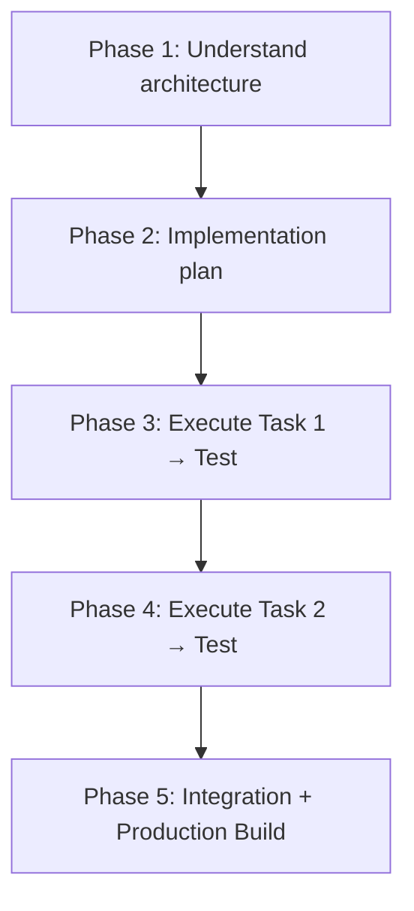

**Compact checkpoint artifact example:**
```text
CURRENT PROJECT STATE
Architecture: Next.js + Node API + PostgreSQL
Current task: Implement profile editing
Completed: API route, validation
Current failure: Upload returns 413
Relevant files: src/api/profile.ts, src/services/upload.ts
Next step: Inspect upload size middleware
```
</details>

<details>
<summary><strong>🧠 2.4 — Solving "AI Forgot the Context" (4 root causes)</strong></summary>

| Problem | Symptom | Fix |
|---|---|---|
| **A. Context overflow** | Conversation too large | **Compaction** — compress into goals/decisions/state |
| **B. Buried info** | Key rule lost in noise | Externalize into `AGENTS.md` / `ARCHITECTURE.md` / `DECISIONS.md` |
| **C. Drifting assumptions** | Silent swap of Redis → RabbitMQ | Maintain a **decision log** marked `LOCKED` |
| **D. Unclear current task** | Agent loses the thread | Maintain a **working-memory object** |

```json
{
  "goal": "Implement OAuth callback",
  "current_subtask": "Fix production redirect URI",
  "status": "debugging",
  "relevant_files": ["src/auth/callback.ts", "src/config/auth.ts"],
  "last_result": "401 invalid redirect URI",
  "next_action": "Compare production environment configuration",
  "blockers": []
}
```
</details>

<details>
<summary><strong>🗂️ 2.5 — Three-Tier Context Architecture</strong></summary>

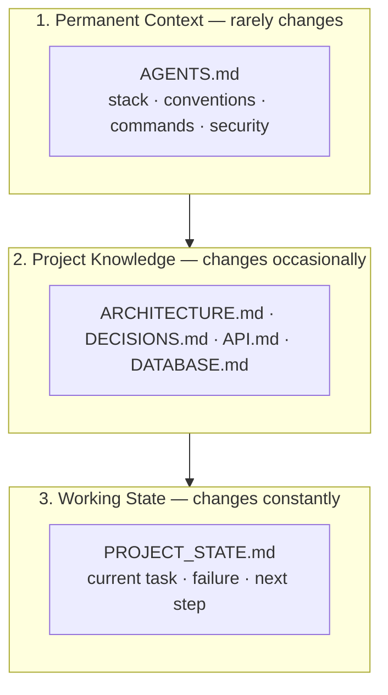
</details>

<details>
<summary><strong>🔌 2.6 — Designing MCP Tools for Low Token Usage</strong></summary>

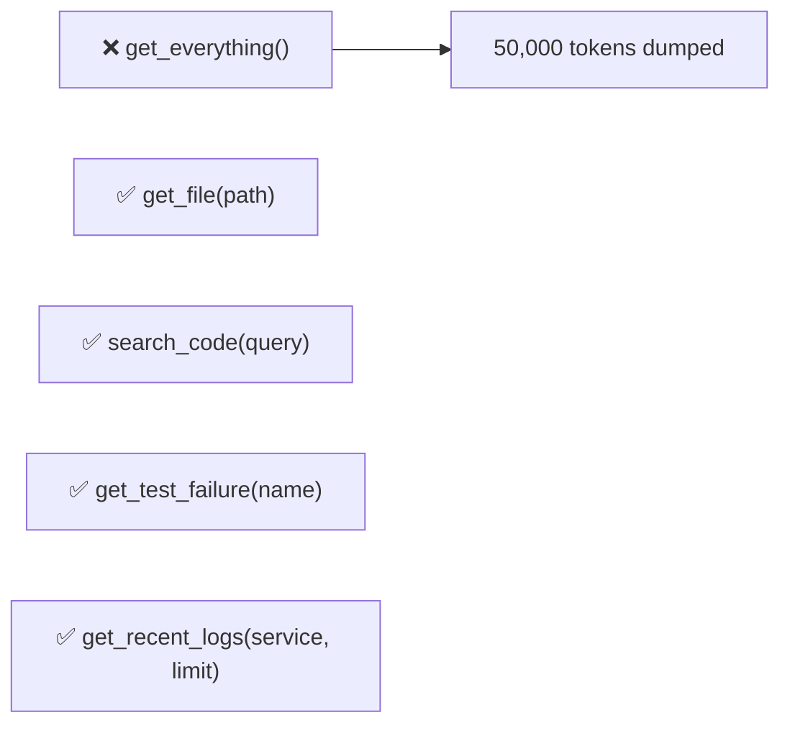

> ⚠️ Every extra tool definition costs context space *before* it's ever called. Scope agents to the minimum tool set the task needs.
</details>

<details>
<summary><strong>✍️ 2.7 — Prompting Reduces Exploration</strong></summary>

```mermaid
flowchart TD
    A["❌ 'Implement authentication.'"] --> B{AI must guess}
    B --> C[JWT? Sessions? OAuth? Redis? NextAuth?]
    C --> D[Inspects 50 files just to decide]
```

```mermaid
flowchart TD
    E["✅ Objective + existing architecture<br/>+ scope + constraints + validation"] --> F[Agent knows exactly what to build]
```

**Also add:** "Search for an existing implementation before creating one" · "Only expand investigation when genuinely necessary."
</details>

<details>
<summary><strong>🧪 2.8 — The Verification Pyramid</strong></summary>

```mermaid
flowchart TD
    L1["Level 1 — Static (typecheck, lint) ⚡ fastest"] --> L2[Level 2 — Unit Tests]
    L2 --> L3[Level 3 — Integration Tests]
    L3 --> L4[Level 4 — End-to-End Tests]
    L4 --> L5[Level 5 — Production Build]
    L5 --> L6[Level 6 — Runtime Verification via Reticle]
```

> Run the **cheapest relevant test first** — don't rerun the whole suite after a one-line change.
</details>

<details>
<summary><strong>🛑 2.9 — Failure-Handling Protocol & the "Two-Failure Rule"</strong></summary>

```mermaid
flowchart TD
    A[Validation Fails] --> B[Read exact error]
    B --> C[Identify smallest likely cause]
    C --> D[Inspect only relevant files]
    D --> E[Apply smallest justified fix]
    E --> F[Re-run failed validation]
    F --> G{Same failure again?}
    G -->|No| H[✅ Continue]
    G -->|Yes| I[🛑 STOP — reassess assumption / architecture / environment]
```
</details>

<details>
<summary><strong>🏛️ 2.10 — Five Big Architectural Changes</strong></summary>

```mermaid
flowchart LR
    A[1. Retrieval-based context] 
    B[2. Persistent project memory]
    C[3. Context compaction]
    D[4. Specialized subagents]
    E[5. Model routing]
```

```mermaid
flowchart TD
    Main[Main Agent] --> Arch[Architecture Subagent]
    Main --> Research[Codebase Research Subagent]
    Main --> Test[Testing Subagent]
    Main --> Debug[Debugging Subagent]
    Arch -.summary only.-> Main
    Research -.summary only.-> Main
    Test -.summary only.-> Main
    Debug -.summary only.-> Main
```
</details>

<details>
<summary><strong>📜 2.11 — Master Instruction Template</strong></summary>

```text
# OBJECTIVE
Complete the task while minimizing unnecessary exploration and retries.

# DISCOVERY
Inspect only what's relevant. Search for existing implementations first.

# PLANNING
Concise plan: target files, expected change, validation method per step.

# EXECUTION
Small, minimal, logically independent changes. Preserve conventions.

# FAILURE HANDLING
Smallest likely cause → smallest fix → re-run failed check.
Same failure twice → STOP and reassess assumptions.

# CONTEXT MANAGEMENT
Preserve: objective, criteria, decisions, modified files, failures, next action.
Discard: resolved errors, obsolete plans, raw tool output once summarized.

# TOOLS
Use only what's relevant to the current subtask.

# VALIDATION ORDER
Typecheck → Lint → Targeted tests → Integration → Build → Runtime

# DEFINITION OF DONE
Criteria met + tests pass + build succeeds + issues reported honestly.
No unrelated "extra improvements" after completion.
```
</details>

[⬆ Back to Navigate](#-navigate)

---

## 3. 🛡️ Security Testing, Developer Knowledge & Anti-Vibe-Coding

<details>
<summary><strong>🛡️ 3.1 — Pentesting with Strix: Scoped, Not Open-Ended</strong></summary>

> ⚠️ Only run it against systems you **own or are explicitly authorized to test.**

```mermaid
flowchart TD
    A[Developer understands app] --> B[Define scope + rules of engagement]
    B --> C[Run targeted assessment]
    C --> D[Review validated finding]
    D --> E[Understand root cause]
    E --> F[Minimal fix]
    F --> G[Run existing tests]
    G --> H[Retest finding]
    H --> I[Production build]
```

```text
Target: local development application
Scope: auth flows, user-owned resources, relevant API endpoints
Focus: broken access control, IDOR, auth bypass, input validation, JWT handling
Constraints: authorized environment only, reproducible findings only
```

🔗 [Strix Documentation](https://docs.strix.ai/)
</details>

<details>
<summary><strong>🧠 3.2 — Vibe Coding vs. AI-Assisted Engineering</strong></summary>

```mermaid
flowchart TD
    subgraph Vibe["❌ Vibe Coding"]
    V1["I need authentication."] --> V2[AI figures everything out]
    V2 --> V3[AI picks architecture, writes 20 files]
    V3 --> V4[Something breaks]
    V4 --> V5["'AI, fix everything' — loop"]
    end

    subgraph Eng["✅ AI-Assisted Engineering"]
    E1[Problem: OAuth callback fails] --> E2[Likely area: auth config]
    E2 --> E3[Task: inspect specific files, verify hypothesis]
    E3 --> E4[Targeted investigation]
    E4 --> E5[Small fix → targeted verification]
    end
```

> A skilled programmer reduces AI token usage simply by knowing what question to ask. Developer knowledge is a **context compressor**.
</details>

<details>
<summary><strong>📚 3.3 — Why Knowing Good Repos/Architecture Reduces AI Dependency</strong></summary>

```mermaid
mindmap
  root((Mental<br/>Library))
    Authentication
      established patterns
    Background Jobs
      queue/worker patterns
    Payments
      official provider architecture
    Real-time
      WebSocket/pub-sub
    Search
      full-text vs vector
    Testing
      unit/integration/E2E
    Security
      OWASP categories
```
</details>

<details>
<summary><strong>🪜 3.4 — The AI Escalation Ladder</strong></summary>

```mermaid
flowchart TD
    L0["Level 0 — You already know it → just code it (0 tokens)"]
    L1[Level 1 — Documentation lookup]
    L2[Level 2 — Code search]
    L3[Level 3 — Reference implementation]
    L4[Level 4 — AI targeted assistance]
    L5[Level 5 — Coding agent]
    L6[Level 6 — Autonomous agent loop]
    L0 --> L1 --> L2 --> L3 --> L4 --> L5 --> L6
```

> Don't jump straight to Level 6 for everything.
</details>

<details>
<summary><strong>✅ 3.5 — Five Questions Before Calling an Agent</strong></summary>

```mermaid
flowchart TD
    Q1{Understand the problem?} -->|No| I1[Investigate first] --> Q1
    Q1 -->|Yes| Q2{Know affected area?}
    Q2 -->|No| I2[Code search / logs / docs] --> Q2
    Q2 -->|Yes| Q3{Can define expected behavior?}
    Q3 -->|No| I3[Write acceptance criteria] --> Q3
    Q3 -->|Yes| Q4{Can verify the result?}
    Q4 -->|No| I4[Build tests first] --> Q4
    Q4 -->|Yes| U[✅ Use AI]
```
</details>

<details>
<summary><strong>⚖️ 3.6 — The Formula</strong></summary>

```text
Developer Knowledge
   + Good Problem Definition
   + Existing Proven Architecture
   + Targeted Context
   + AI Assistance
   + Deterministic Verification
   = High-quality AI-assisted engineering

No Understanding + "Build everything" + Huge context
   + Autonomous agent + No verification
   = Vibe coding ❌
```
</details>

[⬆ Back to Navigate](#-navigate)

---

## 4. 🤖 The AI Model Landscape

> ⚠️ Exact GPU counts, power draw, and per-request energy use are **not publicly disclosed**. Prices/models shift constantly — verify against current provider docs.

```mermaid
flowchart TD
    U[User] --> Product["AI Product / Agent<br/>Cursor · Claude Code · Antigravity · Cline"]
    Product --> Router{Model Router}
    Router --> GPT[GPT family]
    Router --> Claude[Claude family]
    Router --> Gemini[Gemini family]
    GPT --> HW[GPU / TPU / AI Chip]
    Claude --> HW
    Gemini --> HW
```

<details>
<summary><strong>🅰️ 4.1 — OpenAI: GPT Family</strong></summary>

| Model | Position | Notes |
|---|---|---|
| GPT-5.6 Sol | Frontier | Hardest engineering, terminal-heavy agentic work |
| GPT-5.6 Terra | Balanced | Everyday multi-file coding |
| GPT-5.6 Luna | Cheapest/fastest | Search, classification, summarization, routing |

**Ranking:** Raw capability `Sol > Terra > Luna` · Cost efficiency `Luna > Terra > Sol`
</details>

<details>
<summary><strong>🅱️ 4.2 — Anthropic: Claude Family</strong></summary>

```mermaid
flowchart TD
    F["Fable / Mythos<br/>extreme frontier"] --> O[Opus<br/>high-end reasoning/coding]
    O --> S["Sonnet<br/>⭐ balanced sweet spot"]
    S --> H[Haiku<br/>speed + low cost]
```

| Tier | Best for |
|---|---|
| Claude Fable 5 / Mythos 5 | Genuinely hard, long-running problems only |
| Claude Opus 5 | Complex repos, deep architecture judgment |
| **Claude Sonnet 5** | Everyday agentic coding — best quality/cost ratio |
| Claude Haiku 4.5 | Cheap subagents, classification, routing |

> Note: Claude Fable 5 / Mythos 5 access was briefly suspended (Jun 12–Jul 1, 2026) for export-control compliance, then restored. See [Anthropic's statement](https://www.anthropic.com/news/fable-mythos-access).

**Ranking:** Best coding cost/performance → **Sonnet > Opus > Haiku > Fable/Mythos**
</details>

<details>
<summary><strong>🅲️ 4.3 — Google: Gemini Family</strong></summary>

```mermaid
flowchart LR
    A[Rename/Refactor] --> Low[Low Thinking]
    B[Normal Coding] --> Med[Medium Thinking]
    C[Complex Debugging] --> High[High Thinking]
```

Gemini 3.7 Flash: long context, multimodal, configurable thinking levels. **Antigravity** = Google's agentic execution layer built on Gemini.
</details>

<details>
<summary><strong>🅳️ 4.4 — xAI Grok · 🅴️ DeepSeek · 🅵️ Qwen/Llama</strong></summary>

- **Grok 4.6** — strong long-context reasoning, competitive coding/agent use, available inside Cursor.
- **DeepSeek** — Mixture-of-Experts: V4 Pro has 1.6T total params but only ~49B *active* per token.

```mermaid
flowchart LR
    Total["1.6T total parameters"] -->|MoE routing| Active["~49B ACTIVE per token"]
```

- **Qwen / Llama** — open-weight ecosystem for self-hosting, fine-tuning, private deployment.
</details>

<details>
<summary><strong>🅶️ 4.5 — Perplexity · Cursor · Lovable · Antigravity (Products, not models)</strong></summary>

| Product | What it actually is |
|---|---|
| Perplexity | Search system + Sonar models + citations — not a coding-model substitute |
| Cursor | Model orchestration layer — routes across GPT/Claude/Gemini/Grok/Composer |
| Lovable | AI app-building product — great for MVPs, not deep custom architecture |
| Antigravity | Google's agentic platform, built on Gemini |
| Claude Code | Claude model + terminal + filesystem + planning + agent loop |

> Comparing "Claude vs. Cursor" is like comparing an engine to a car.
</details>

<details>
<summary><strong>🏆 4.6 — Practical Tiering for Coding & Agentic Work</strong></summary>

```mermaid
flowchart TD
    subgraph S["Tier S — Hardest Autonomous Engineering"]
    S1[Claude Fable/Mythos 5]
    S2[GPT-5.6 Sol]
    S3[Claude Opus 5]
    end
    subgraph A["Tier A — Everyday Sweet Spot"]
    A1[Claude Sonnet 5]
    A2[GPT-5.6 Terra]
    A3[Gemini 3.7 Flash]
    A4[Grok 4.6]
    end
    subgraph B["Tier B — High-Volume / Cheap"]
    B1[GPT-5.6 Luna]
    B2[Claude Haiku 4.5]
    B3[Gemini Flash tiers]
    end
```

> A more capable model can use **fewer total tokens** overall — a weak model failing 4× can cost more than a strong model succeeding once. Optimize for **cost per verified successful task**.
</details>

<details>
<summary><strong>🖥️ 4.7 — Hardware Layer</strong></summary>

| Chip | Memory | Bandwidth | Notes |
|---|---|---|---|
| NVIDIA H100 SXM | 80 GB | 3.35 TB/s | up to 700W TDP |
| NVIDIA H200 | 141 GB | 4.8 TB/s | up to 700W TDP |
| NVIDIA Blackwell (B200) | — | 10 TB/s die-to-die | 208B transistors |
| DGX B200 (8×GPU) | 1,440 GB total | 64 TB/s aggregate | ~14.3 kW system power |
| GB200 NVL72 (72×GPU) | 13.4 TB total | 576 TB/s | rack-scale AI system |

```mermaid
flowchart LR
    CPU[CPU — orchestration, flexible, less parallel]
    GPU[GPU — massively parallel matrix ops]
    TPU[TPU — Google's tensor hardware, powers Gemini]
    NPU[NPU — small local AI, laptops/phones]
```

> We genuinely **don't know** exact watts-per-request for any specific model call — treat any such public claim skeptically.
</details>

[⬆ Back to Navigate](#-navigate)

---

## 5. ✅ Master Cheat Sheet

- [ ] Objective, scope, constraints, execution, validation, stop condition — every prompt
- [ ] Replace vague words with measurable pass/fail criteria
- [ ] Progressive context expansion, not full-repo dumps
- [ ] Externalize stable knowledge into `AGENTS.md` / `ARCHITECTURE.md` / `DECISIONS.md`
- [ ] Compact long conversations into a state checkpoint
- [ ] Enable only the MCP tools relevant to the current task
- [ ] Route simple subtasks to cheap/local models
- [ ] Cheapest validation first: typecheck → lint → test → build → runtime
- [ ] Apply the "two-failure rule" — stop patching blindly
- [ ] Explicit stop condition — no post-completion scope creep

```mermaid
flowchart TD
    Q1[Exact problem?] --> Q2[Expected behavior?]
    Q2 --> Q3[Likely location?]
    Q3 --> Q4[Preferred approach?]
    Q4 --> Q5[How to verify?]
    Q5 --> Go["🚀 Now call the agent"]
```

[⬆ Back to Navigate](#-navigate)

---

## 6. 🎓 Recommended Learning Path

```mermaid
flowchart TD
    T1["Tier 1: Agentic Coding<br/>Cline · Roo Code · Reticle"] --> T2["Tier 2: Memory & Context<br/>Graphiti · Context Engineering"]
    T2 --> T3["Tier 3: Local Models<br/>Ollama"]
    T3 --> T4["Tier 4: Quality & Review<br/>CodeRabbit · Tests · CI/CD"]
```

**Hands-on build order:**

1. Install Ollama, experiment with local models
2. Use an agent (Cline / Roo Code)
3. Write a real `AGENTS.md` for a test project
4. Add MCP tools selectively
5. Add Reticle for runtime verification
6. Add automated tests
7. Add CodeRabbit for review
8. Try a Ralph-style implementation loop
9. Later: add Graphiti or another memory layer

> **If only three things:** `AGENTS.md` + decision files → checkpoints/compaction → strict implement→test→feedback loop.

[⬆ Back to Navigate](#-navigate)

---

## 7. 🔗 Reference Links

| Tool | Link |
|---|---|
| Reticle | https://github.com/reticlehq/reticle |
| Graphiti | https://github.com/getzep/graphiti |
| CodeRabbit | https://docs.coderabbit.ai/ |
| Ollama | https://github.com/ollama/ollama |
| Cline | https://github.com/cline/cline |
| Roo Code | https://github.com/samhvw8/Roo-Cline |
| Strix | https://docs.strix.ai/ |
| Anthropic — Context Engineering Guide | https://www.anthropic.com/engineering/effective-context-engineering-for-ai-agents |
| Model Context Protocol Spec | https://modelcontextprotocol.io/ |

---

<div align="center">

*Compiled as a living knowledge-base document. Model names, prices, and benchmarks change frequently — verify against provider docs before relying on them.*

[⬆ Back to top](#-ai-engineering-playbook)

</div>
