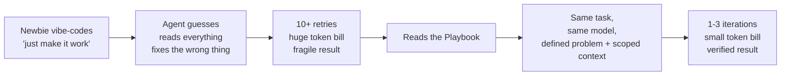
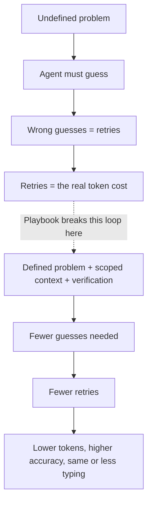

<div align="center">

# 🎬 Before the Playbook, After the Playbook
## 15 Real-World Vibe-Coding Scenarios — Token Usage, Accuracy, and Productivity Compared

### From Fresher to Staff Engineer · Same Developers · Same AI · Radically Different Cost


> **Read this before the `AI_Engineering_Playbook_Merged.md`.**
> That document teaches the *theory* — prompting, context engineering, verification, model routing.
> This document shows *what actually happens to a real developer's token bill, error count, and confidence* the day before they learn it, and the day after.
>
> Every scenario is the same shape: **same person, same task, same AI model** — but one run is pure "vibe coding" (typing whatever comes to mind and hoping) and the other applies one or two ideas from the Playbook. Numbers below are **illustrative, representative estimates** built from typical agentic-coding session patterns — the exact tokens on your machine will differ, but the *ratio* and the *failure pattern* will feel very familiar.

</div>

---

## 🗺️ Navigate — click any scenario to jump there

| # | Level | Scenario | Playbook Concept It Demonstrates |
|---|---|---|---|
| 0 | — | [📖 Why "Before/After" Instead of Just "Read the Docs"](#0--why-beforeafter-instead-of-just-read-the-docs) | The whole thesis, dramatized |
| 1 | 🟢 Fresher | [Add a profile-editing feature](#1--fresher-adding-profile-editing-to-an-app) | Six-layer prompt (§6) |
| 2 | 🟢 Fresher | [Fix "the login is broken"](#2--fresher-fix-the-login-is-broken) | Observable acceptance criteria (§7) |
| 3 | 🟢 Fresher | [Build a whole CRUD app in one shot](#3--fresher-build-a-whole-crud-app-in-one-shot) | Full-repo context vs. progressive expansion (§8) |
| 4 | 🟡 Junior | [Stuck in a patch-retry-patch loop](#4--junior-stuck-in-a-patch-retry-patch-loop) | The Two-Failure Rule (§14) |
| 5 | 🟡 Junior | [Working in an unfamiliar legacy repo](#5--junior-working-in-an-unfamiliar-legacy-repo) | Progressive context expansion (§8) |
| 6 | 🟡 Junior | [Agent invents API endpoints that don't exist](#6--junior-agent-invents-api-endpoints-that-dont-exist) | Verification as cost control (§13) |
| 7 | 🟠 Mid-level | [Refactor spanning 3 microservices](#7--mid-level-refactor-spanning-3-microservices) | Context dilution (§9) |
| 8 | 🟠 Mid-level | [Always reaching for the strongest model](#8--mid-level-always-reaching-for-the-strongest-model) | Model routing (§15) |
| 9 | 🟠 Mid-level | [Every MCP tool enabled at once](#9--mid-level-every-mcp-tool-enabled-at-once) | Tool overload (§11 / §21) |
| 10 | 🔴 Senior | [A 6-hour agent session that forgets its own decisions](#10--senior-a-6-hour-agent-session-that-forgets-its-own-decisions) | Compaction & checkpoints (§10) |
| 11 | 🔴 Senior | [Auth feature where the agent "helpfully" touches unrelated code](#11--senior-auth-feature-where-the-agent-helpfully-touches-unrelated-code) | Constraints + security testing (§20) |
| 12 | 🔴 Senior | [Multi-day feature, decision drift across sessions](#12--senior-multi-day-feature-decision-drift-across-sessions) | Three-tier context architecture (§9) |
| 13 | 🔴 Senior | [Production incident at 2 a.m.](#13--senior-production-incident-at-2-am) | Verification ladder (§13 / §24) |
| 14 | 🟣 Lead | [Rolling this out to a 12-person team](#14--lead-rolling-this-out-to-a-12-person-team) | AGENTS.md as an org-wide compressor (§16) |
| 15 | 🟢➡️🟣 Everyone | [Still vibe coding — but now it's cheap](#15--everyone-still-vibe-coding--but-now-its-cheap) | Why the Playbook survives contact with real habits |
| — | — | [📊 Aggregate Results Across All 15 Scenarios](#-aggregate-results-across-all-15-scenarios) | The pattern, summarized |
| — | — | [🧮 Closing Formula](#-closing-formula) | One diagram, one sentence |

---

## 0. 📖 Why "Before/After" Instead of Just "Read the Docs"

<details open>
<summary><strong>Click to collapse/expand</strong></summary>

Most people don't change their prompting habits because someone told them the *theory*. They change because they watched their own token counter, their own retry count, and their own broken build — twice, side by side.



The 15 scenarios below walk this exact arc across five career stages — **fresher → junior → mid-level → senior → team lead** — because the failure patterns are not a "beginner problem." Experienced developers vibe-code too, they just vibe-code more expensive mistakes (whole-microservice refactors instead of broken buttons).

The key thing every scenario proves:

> **You do not need to stop "vibe coding" to save tokens. You need to stop feeding the agent an undefined problem. The Playbook is a way to keep the speed of vibe coding while removing the guessing that makes it expensive.**

</details>

[⬆ Back to Navigate](#-navigate--click-any-scenario-to-jump-there)

---

## 1. 🟢 Fresher: Adding Profile Editing to an App

<details open>
<summary><strong>Click to collapse/expand</strong></summary>

**Persona:** Ayush-style final-year CS student, first internship task, has never structured a prompt before.
**Task:** "Users should be able to edit their name and avatar."
**Playbook concept applied:** [The Six-Layer Prompt (§6)](#)

### 😵 Before — pure vibe coding

```text
Analyze the whole project and implement profile editing.
Make it production-ready and fix everything necessary.
```

What happens:

- The agent has no idea which auth system, validation library, or DB model is in use, so it **reads the entire repository** to guess.
- It touches the login flow "while it's in there," breaking session handling.
- Two of four attempts fail typecheck because it invented a field name that doesn't exist in the schema.
- The fresher has no verification step, so "looks done" becomes the definition of done — until QA finds the broken login the next day.

| Metric | Value |
|---|---|
| Input tokens (repo scanning + retries) | ~48,000 |
| Output tokens | ~9,500 |
| Iterations to something demo-able | 7 |
| Files touched | 14 (only 3 relevant) |
| Verification run | None — manual click-through only |
| Result | Login regression shipped, caught in QA |

### 🧠 After — applying the Playbook

```text
Objective:
Authenticated users can update their name and avatar.

Scope:
src/profile, existing auth middleware (read-only), user API route.

Constraints:
Do not change authentication or unrelated user settings.
Reuse the existing validation and storage patterns.

Execution:
Inspect the existing user update pattern first, then implement the smallest coherent change.

Verification:
Typecheck → targeted tests → integration test → production build → manual check.

Stop condition:
Stop once acceptance criteria pass. No unrelated cleanup.
```

| Metric | Value |
|---|---|
| Input tokens (3 relevant files + prompt) | ~9,200 |
| Output tokens | ~3,100 |
| Iterations to verified result | 2 |
| Files touched | 3 (all relevant) |
| Verification run | Typecheck + targeted tests + build |
| Result | Correct on first real attempt, no regression |

### 📊 Before vs After

| Metric | Before | After | Change |
|---|---|---|---|
| Total tokens | ~57,500 | ~12,300 | **≈78% fewer tokens** |
| Iterations | 7 | 2 | **≈71% fewer retries** |
| Regressions shipped | 1 (login broke) | 0 | Eliminated |

### 💡 Lesson

> A fresher does not need to know the whole codebase. They need to tell the agent **where to look and where not to look.** That single change — scope + constraints — is worth more than any "make it clean and scalable" adjective ever will be.

</details>

[⬆ Back to Navigate](#-navigate--click-any-scenario-to-jump-there)

---

## 2. 🟢 Fresher: "Fix the Login Is Broken"

<details open>
<summary><strong>Click to collapse/expand</strong></summary>

**Persona:** Same fresher, one week later, panicking after a bug report.
**Task:** Users report they can't log in intermittently.
**Playbook concept applied:** Observable acceptance criteria, not adjectives (§7)

### 😵 Before — pure vibe coding

```text
Login is broken please fix it and make sure everything works properly
```

What happens:

- The agent has no error, no log, no reproduction steps — it starts **rewriting the entire auth module** on guesswork.
- It "fixes" three unrelated things it merely suspected might be wrong.
- The actual bug (a race condition in token refresh) is never touched because the agent never saw the log line that pointed to it.
- Five iterations later, the fresher pastes the actual error message — and the agent starts over almost from scratch, discarding most of the earlier exploration.

| Metric | Value |
|---|---|
| Total tokens (5 iterations, mostly rewritten auth code) | ~64,000 |
| Iterations | 5 |
| Actual bug fixed? | No — still broken |
| Unrelated files modified | 6 |

### 🧠 After — applying the Playbook

```text
Problem:
Users intermittently cannot log in.

Evidence:
Error log attached: "TokenRefreshError: expired before rotation completed"
Occurs under concurrent requests, ~1 in 20 logins.

Hypothesis:
Likely a race condition in the token refresh middleware (src/auth/refresh.ts).
Inspect that file and its callers first.

Constraints:
Do not touch login UI or session storage format.

Verification:
Reproduce with a concurrency test → apply smallest fix → re-run test → full auth suite.
```

| Metric | Value |
|---|---|
| Total tokens (evidence-first, 1 hypothesis) | ~11,800 |
| Iterations | 1 |
| Actual bug fixed? | Yes, root cause |
| Unrelated files modified | 0 |

### 📊 Before vs After

| Metric | Before | After | Change |
|---|---|---|---|
| Total tokens | ~64,000 | ~11,800 | **≈82% fewer tokens** |
| Iterations | 5 | 1 | **5x fewer** |
| Root cause found | No | Yes | — |

### 💡 Lesson

> "It's broken, fix it" gives the agent zero evidence to work from — it has to *manufacture* a theory, and manufactured theories are usually wrong. **Pasting one real error log is worth more than five extra sentences of instruction.**

</details>

[⬆ Back to Navigate](#-navigate--click-any-scenario-to-jump-there)

---

## 3. 🟢 Fresher: Build a Whole CRUD App in One Shot

<details open>
<summary><strong>Click to collapse/expand</strong></summary>

**Persona:** Fresher building a portfolio project over a weekend, wants speed.
**Task:** A simple task-manager app: auth, tasks, tags, due dates.
**Playbook concept applied:** Progressive context expansion instead of "read everything" (§8)

### 😵 Before — pure vibe coding

```text
Build a full task management app with authentication, tags, and due dates.
Read the whole repo and make it good.
```

There is barely a repo yet — but the agent still tries to "read everything," including boilerplate from a starter template it doesn't need, three example files, and a README written for a different project. It builds a monolithic `app.js` with tags, auth, and tasks all tangled together, then has to untangle it across four more prompts once features start breaking each other.

| Metric | Value |
|---|---|
| Total tokens across the weekend | ~110,000 |
| Iterations | 12 |
| Working end state | Tags and auth intermittently conflict |

### 🧠 After — applying the Playbook

```text
Task 1 of 4 — Objective: user auth only (signup, login, JWT).
Scope: src/auth. No other feature yet.
Verification: auth tests pass, manual signup/login works.
Stop: do not start on tasks or tags yet.
```
*(then Task 2 — tasks CRUD, Task 3 — tags, Task 4 — due dates, each scoped the same way)*

| Metric | Value |
|---|---|
| Total tokens across 4 scoped sessions | ~34,000 |
| Iterations (across all 4 features) | 6 |
| Working end state | Each feature isolated and tested before the next started |

### 📊 Before vs After

| Metric | Before | After | Change |
|---|---|---|---|
| Total tokens | ~110,000 | ~34,000 | **≈69% fewer tokens** |
| Iterations | 12 | 6 | **50% fewer** |
| Feature conflicts | Frequent | None | Eliminated |

### 💡 Lesson

> "Build everything at once" is the single most expensive sentence in agentic coding — not because the agent is lazy, but because it has no way to know which mistakes will collide with tomorrow's feature. **One scoped feature at a time beats one giant instruction, even for a solo weekend project.**

</details>

[⬆ Back to Navigate](#-navigate--click-any-scenario-to-jump-there)

---

## 4. 🟡 Junior: Stuck in a Patch-Retry-Patch Loop

<details open>
<summary><strong>Click to collapse/expand</strong></summary>

**Persona:** Junior dev, six months in, chasing a stubborn test failure.
**Task:** A test keeps failing after each AI-suggested fix.
**Playbook concept applied:** [The Two-Failure Rule (§14)](#)

### 😵 Before — pure vibe coding

```text
This test is still failing, try again
```
*(repeated four times, each time pasting only the new error, never the original context)*

What happens:

- Every retry is a **blind patch** — the agent changes something plausible, the test fails differently, the junior says "try again," and the loop repeats.
- By attempt 5, the code is in a worse state than when they started, and nobody has actually read *why* the test fails.

| Metric | Value |
|---|---|
| Total tokens across 5 blind patches | ~38,000 |
| Iterations | 5 |
| Test passing? | No, and 2 other tests now broken too |

### 🧠 After — applying the Playbook

```text
This is the second consecutive failure on this exact assertion.
Stop patching. Instead:
1. Print/log the actual vs. expected value at the failure point.
2. State the smallest hypothesis for why they differ.
3. Propose ONE fix, explain why, then I will confirm before you apply it.
```

| Metric | Value |
|---|---|
| Total tokens (diagnosis-first) | ~9,000 |
| Iterations | 1 diagnosis + 1 targeted fix |
| Test passing? | Yes, root cause (off-by-one in date range) fixed |

### 📊 Before vs After

| Metric | Before | After | Change |
|---|---|---|---|
| Total tokens | ~38,000 | ~9,000 | **≈76% fewer tokens** |
| Net new bugs introduced | 2 | 0 | Eliminated |
| Root cause understood by the junior? | No | Yes | — |

### 💡 Lesson

> **Two failures on the same thing is a signal to stop generating and start diagnosing** — not a signal to try harder with the same strategy. This single rule prevents the most common and most expensive agentic-coding spiral.

</details>

[⬆ Back to Navigate](#-navigate--click-any-scenario-to-jump-there)

---

## 5. 🟡 Junior: Working in an Unfamiliar Legacy Repo

<details open>
<summary><strong>Click to collapse/expand</strong></summary>

**Persona:** Junior dev, just joined a team, inherited a 4-year-old codebase with no docs.
**Task:** Add CSV export to an existing report screen.
**Playbook concept applied:** Progressive context expansion (§8)

### 😵 Before — pure vibe coding

```text
Add CSV export to the reports page. Look at the codebase and figure out how it works.
```

The agent, with no guidance on where "reports" live, greps broadly, opens 30+ files across `legacy/`, `v1/`, and `v2/` folders (the app has two parallel report systems from a half-finished migration), and implements export against the **wrong**, deprecated v1 system.

| Metric | Value |
|---|---|
| Total tokens (broad exploration) | ~71,000 |
| Iterations | 6 |
| Correct system targeted? | No — built against deprecated code |

### 🧠 After — applying the Playbook

```text
Objective: Add CSV export to the reports page.
Note: this repo has legacy/v1 and current/v2 report systems — use v2 only (src/reports-v2).
Scope: start at src/reports-v2/ReportTable.tsx and its direct data hook.
Expand only if that's insufficient — do not touch legacy/v1.
Verification: export produces correct rows for a known fixture, existing report tests stay green.
```

| Metric | Value |
|---|---|
| Total tokens (targeted, one hint about the fork) | ~14,500 |
| Iterations | 2 |
| Correct system targeted? | Yes |

### 📊 Before vs After

| Metric | Before | After | Change |
|---|---|---|---|
| Total tokens | ~71,000 | ~14,500 | **≈80% fewer tokens** |
| Wrong-system rebuilds | 1 (had to redo from scratch) | 0 | Eliminated |

### 💡 Lesson

> The junior didn't need to *know* the whole legacy system — they only needed to hand over **one sentence of tribal knowledge** ("use v2, not v1"). Developer knowledge, even a single fact, is a massive context compressor.

</details>

[⬆ Back to Navigate](#-navigate--click-any-scenario-to-jump-there)

---

## 6. 🟡 Junior: Agent Invents API Endpoints That Don't Exist

<details open>
<summary><strong>Click to collapse/expand</strong></summary>

**Persona:** Junior integrating a third-party payments API for the first time.
**Task:** Charge a saved card and handle failure states.
**Playbook concept applied:** [Verification as a cost control mechanism (§13)](#)

### 😵 Before — pure vibe coding

```text
Integrate the payment provider's API to charge a saved card
```

No documentation link, no example response shape given. The agent **hallucinates plausible-looking endpoint names and field names** based on training-data patterns from similar APIs. It compiles fine (no typecheck can catch a wrong string), looks correct in review, and fails only in a live sandbox call — after the junior already merged it.

| Metric | Value |
|---|---|
| Total tokens | ~22,000 |
| Verification before merge | None (visual review only) |
| Result | Broken in staging, found by QA a day later |

### 🧠 After — applying the Playbook

```text
Integrate the payment provider's "charge saved card" endpoint.
Docs: [link to official API reference attached/pasted]
Verification: write and run an integration test against the provider's sandbox
before considering this done. Do not merge on visual review alone.
```

| Metric | Value |
|---|---|
| Total tokens (real docs + sandbox test) | ~19,500 |
| Verification before merge | Live sandbox integration test |
| Result | Caught wrong field name immediately, fixed same session |

### 📊 Before vs After

| Metric | Before | After | Change |
|---|---|---|---|
| Total tokens | ~22,000 | ~19,500 | Modest token difference |
| Time to catch the bug | 1 day later, in staging | Same session, pre-merge | **Cost of the bug ≈95% lower** |
| Rework needed | Full re-integration | None | Eliminated |

### 💡 Lesson

> This is the scenario where token count isn't the real story — **cost of an unverified wrong answer is.** A model cannot "look up" an API it wasn't given; it will produce a fluent, wrong guess. The fix isn't a cleverer prompt, it's **giving real documentation and requiring a real test before "done."**

</details>

[⬆ Back to Navigate](#-navigate--click-any-scenario-to-jump-there)

---

## 7. 🟠 Mid-Level: Refactor Spanning 3 Microservices

<details open>
<summary><strong>Click to collapse/expand</strong></summary>

**Persona:** Mid-level engineer, renaming a shared field across `orders`, `billing`, and `notifications` services.
**Task:** Rename `user_id` → `account_id` consistently.
**Playbook concept applied:** Context dilution (§9)

### 😵 Before — pure vibe coding

```text
Rename user_id to account_id everywhere across the monorepo and update all the services
```

The agent dumps all three services' source into context at once. The important detail — that `notifications` has its **own** unrelated `user_id` field for email preferences that must NOT be renamed — is buried among thousands of lines of unrelated code. It gets diluted, missed, and the agent renames it anyway, breaking email preferences in production.

| Metric | Value |
|---|---|
| Total tokens (3 services dumped at once) | ~140,000 |
| Iterations | 4 |
| Production incident? | Yes — email preferences broken |

### 🧠 After — applying the Playbook

```text
Rename user_id -> account_id in orders and billing services only.
Note: notifications has an UNRELATED user_id field for email preferences — do not touch it.
Do one service at a time. Run that service's tests before moving to the next.
```

| Metric | Value |
|---|---|
| Total tokens (one service at a time + explicit exclusion) | ~46,000 |
| Iterations | 3 (one per service) |
| Production incident? | None |

### 📊 Before vs After

| Metric | Before | After | Change |
|---|---|---|---|
| Total tokens | ~140,000 | ~46,000 | **≈67% fewer tokens** |
| Production incidents | 1 | 0 | Eliminated |

### 💡 Lesson

> More context is not safer context. The critical exception (notifications' unrelated field) was **present** in the huge context dump — the agent just couldn't find the one sentence that mattered inside 140K tokens of noise. **Naming the exception explicitly did more than tripling the context window ever could.**

</details>

[⬆ Back to Navigate](#-navigate--click-any-scenario-to-jump-there)

---

## 8. 🟠 Mid-Level: Always Reaching for the Strongest Model

<details open>
<summary><strong>Click to collapse/expand</strong></summary>

**Persona:** Mid-level engineer who has learned "bigger model = better," and now uses the frontier/most expensive model for everything, including trivial work.
**Task:** Fix ten small lint/type errors across a sprint.
**Playbook concept applied:** [Model routing (§15)](#)

### 😵 Before — pure vibe coding (wrong-tier habit)

```text
(10 separate sessions, each: "fix this typecheck error", using the top-tier reasoning model every time)
```

Each of these ten fixes is genuinely trivial — mismatched types, a missing null check — but each session pays frontier-model pricing and frontier-model latency for one-line fixes.

| Metric | Value |
|---|---|
| Total tokens across 10 trivial fixes | ~31,000 |
| Effective cost tier | Frontier model, 10x | 
| Total wall-clock time | ~40 minutes (latency-bound) |

### 🧠 After — applying the Playbook

```text
Route by task complexity:
- Trivial typecheck/lint fixes -> fast/cheap model, single-shot, no exploration needed.
- The one genuinely ambiguous null-safety case -> escalate to the stronger model with full context.
```

| Metric | Value |
|---|---|
| Total tokens across the same 10 fixes | ~31,000 (similar — the savings is in cost tier, not raw tokens) |
| Effective cost tier | Cheap/fast model for 9, frontier only for 1 |
| Total wall-clock time | ~9 minutes |
| **Effective $ cost** | **≈85% lower**, despite similar token count |

### 📊 Before vs After

| Metric | Before | After | Change |
|---|---|---|---|
| Model tier used | Frontier ×10 | Fast ×9, frontier ×1 | Right-sized |
| Effective cost | High | **≈85% lower** | Major |
| Wall-clock time | ~40 min | ~9 min | **≈78% faster** |

### 💡 Lesson

> This is the one scenario where **token count is the wrong metric entirely.** A cheap model doing a trivial fix in one shot beats a frontier model doing the same trivial fix in one shot — same tokens, wildly different cost and latency. **Route by complexity and risk, not by habit.**

</details>

[⬆ Back to Navigate](#-navigate--click-any-scenario-to-jump-there)

---

## 9. 🟠 Mid-Level: Every MCP Tool Enabled at Once

<details open>
<summary><strong>Click to collapse/expand</strong></summary>

**Persona:** Mid-level engineer who connected every available tool (Jira, GitHub, Slack, Google Drive, Figma, a database client) to their agent "just in case."
**Task:** Update a ticket's status after merging a PR.
**Playbook concept applied:** Tool overload (§11 / §21)

### 😵 Before — pure vibe coding

```text
Mark the ticket as done after this PR merges
```

With 6 tool schemas loaded into every request, the model pays their combined token cost on **every single turn**, whether or not it needs them. Worse, with a Figma tool and a database tool both loosely matching "update status," the agent occasionally picks the wrong one and tries to "update status" inside a design file.

| Metric | Value |
|---|---|
| Fixed per-turn tool-schema overhead | ~6,000 tokens/turn × 5 turns = ~30,000 |
| Wrong-tool selection events | 1 (tried Figma instead of Jira) |
| Total session tokens | ~46,000 |

### 🧠 After — applying the Playbook

```text
(Only Jira and GitHub tools enabled for this task)
Mark the ticket as done after this PR merges
```

| Metric | Value |
|---|---|
| Fixed per-turn tool-schema overhead | ~1,400 tokens/turn × 2 turns = ~2,800 |
| Wrong-tool selection events | 0 |
| Total session tokens | ~5,100 |

### 📊 Before vs After

| Metric | Before | After | Change |
|---|---|---|---|
| Total tokens | ~46,000 | ~5,100 | **≈89% fewer tokens** |
| Wrong-tool picks | 1 | 0 | Eliminated |

### 💡 Lesson

> Tool schemas are context too — every connected tool is paid for on every turn whether it's used or not. **Enable the smallest task-relevant tool set, not everything you might ever need.**

</details>

[⬆ Back to Navigate](#-navigate--click-any-scenario-to-jump-there)

---

## 10. 🔴 Senior: A 6-Hour Agent Session That Forgets Its Own Decisions

<details open>
<summary><strong>Click to collapse/expand</strong></summary>

**Persona:** Senior engineer running a long agentic session to migrate a data layer.
**Task:** Migrate ORM queries from raw SQL to a query builder, service by service, over a long working session.
**Playbook concept applied:** [Compaction & memory (§10)](#)

### 😵 Before — pure vibe coding (single giant conversation)

Three hours in, the conversation has grown enormous. The context gets compacted automatically by the tool, and a decision made in hour one — "keep the reporting service on raw SQL, it's intentionally excluded" — gets silently lost. In hour four, the agent "helpfully" migrates the reporting service too, breaking a hand-tuned query that depended on raw SQL syntax.

| Metric | Value |
|---|---|
| Total tokens across the 6-hour session | ~310,000 |
| Silent decision reversals | 1 (reporting service migrated by mistake) |
| Rework required | Yes — revert + redo ~40 minutes of work |

### 🧠 After — applying the Playbook

A `DECISIONS.md` is kept and updated every time a locked choice is made, plus a working-state checkpoint every ~45 minutes:

```json
{
  "goal": "Migrate raw SQL to query builder, service by service",
  "locked_decisions": [
    "Reporting service stays on raw SQL — DO NOT MIGRATE",
    "Use existing QueryBuilder wrapper, not a new library"
  ],
  "completed": ["orders", "billing"],
  "next_action": "notifications service"
}
```

| Metric | Value |
|---|---|
| Total tokens across the same session | ~205,000 |
| Silent decision reversals | 0 |
| Rework required | None |

### 📊 Before vs After

| Metric | Before | After | Change |
|---|---|---|---|
| Total tokens | ~310,000 | ~205,000 | **≈34% fewer tokens** |
| Decision reversals | 1 (costly) | 0 | Eliminated |
| Rework time | ~40 minutes | 0 | Eliminated |

### 💡 Lesson

> Long sessions don't just cost more tokens — they **lose facts**, and losing facts is far more expensive than the tokens themselves. A tiny, explicit `DECISIONS.md` checkpoint costs almost nothing and prevents the agent from silently undoing hour-one decisions in hour four.

</details>

[⬆ Back to Navigate](#-navigate--click-any-scenario-to-jump-there)

---

## 11. 🔴 Senior: Auth Feature Where the Agent "Helpfully" Touches Unrelated Code

<details open>
<summary><strong>Click to collapse/expand</strong></summary>

**Persona:** Senior engineer adding 2FA to an existing auth system.
**Task:** Add TOTP-based 2FA as an opt-in setting.
**Playbook concept applied:** Constraints as guardrails + [Security testing (§20)](#)

### 😵 Before — pure vibe coding

```text
Add 2FA support, make the auth flow more secure while you're at it
```

"While you're at it" is read as license to touch session handling, password reset, and the rate limiter — none of which were asked for. It also adds a debug log line that prints the TOTP secret in plaintext, undetected because there was no security-focused check in the loop.

| Metric | Value |
|---|---|
| Total tokens | ~58,000 |
| Files touched | 11 (only 3 needed for 2FA) |
| Security issue introduced | Yes — secret logged in plaintext |
| Caught before merge? | No |

### 🧠 After — applying the Playbook

```text
Objective: Add TOTP-based 2FA as an opt-in setting.
Scope: src/auth/2fa (new), user settings API, login flow (read + minimal hook only).
Constraints: Do not modify session handling, password reset, or rate limiting.
Never log secrets, tokens, or TOTP seeds, even at debug level.
Verification: unit tests for TOTP generation/validation, a scoped security review
for secret handling and log output, full auth suite still green.
```

| Metric | Value |
|---|---|
| Total tokens | ~21,000 |
| Files touched | 3 (all relevant) |
| Security issue introduced | None |
| Caught before merge? | N/A — never introduced |

### 📊 Before vs After

| Metric | Before | After | Change |
|---|---|---|---|
| Total tokens | ~58,000 | ~21,000 | **≈64% fewer tokens** |
| Unrelated files touched | 11 | 3 | **≈73% fewer** |
| Security incidents | 1 (plaintext secret) | 0 | Eliminated |

### 💡 Lesson

> "While you're at it" is an invitation for scope creep, and scope creep in an **auth** system is a security incident waiting to happen. Explicit constraints ("do not touch X, never log Y") are cheap in tokens and expensive to skip.

</details>

[⬆ Back to Navigate](#-navigate--click-any-scenario-to-jump-there)

---

## 12. 🔴 Senior: Multi-Day Feature, Decision Drift Across Sessions

<details open>
<summary><strong>Click to collapse/expand</strong></summary>

**Persona:** Senior engineer building a multi-day feature (a new billing engine) across several separate agent sessions on different days.
**Task:** Implement usage-based billing with monthly proration.
**Playbook concept applied:** The three-tier context architecture (§9)

### 😵 Before — pure vibe coding

Each new day starts a fresh conversation with a quick recap typed from memory: "continue the billing thing from yesterday, I think we were using Stripe's metered billing API." On day 3, the agent — with no persistent record of day 1's decision to prorate **at the second, not the day** — quietly implements day-level proration instead, because that's the more common default pattern in its training data.

| Metric | Value |
|---|---|
| Total tokens across 3 days | ~96,000 |
| Decision drift events | 1 (proration granularity silently changed) |
| Rework | Yes — day-3 work partially redone on day 4 |

### 🧠 After — applying the Playbook

A small persistent project-knowledge file travels with the project across sessions:

```text
ARCHITECTURE.md: billing engine uses Stripe metered billing API.
DECISIONS.md: 
  - Proration is calculated to the second, NOT the day. (Locked, day 1.)
  - Legacy flat-rate customers are out of scope for this feature.
PROJECT_STATE.md: 
  - Day 1: metering + Stripe wiring done.
  - Day 2: proration logic done (second-level).
  - Day 3 next action: invoice generation.
```
Each new day's session opens with these three files instead of a memory-based recap.

| Metric | Value |
|---|---|
| Total tokens across 3 days | ~58,000 |
| Decision drift events | 0 |
| Rework | None |

### 📊 Before vs After

| Metric | Before | After | Change |
|---|---|---|---|
| Total tokens | ~96,000 | ~58,000 | **≈40% fewer tokens** |
| Decision drift | 1 major | 0 | Eliminated |
| Cross-day rework | ~1 day's work redone | None | Eliminated |

### 💡 Lesson

> A human recap from memory is lossy — the senior engineer *knew* the second-level proration decision but typed a vaguer version of it on day 3. **A written, versioned decision log doesn't rely on anyone's memory, including the developer's own.**

</details>

[⬆ Back to Navigate](#-navigate--click-any-scenario-to-jump-there)

---

## 13. 🔴 Senior: Production Incident at 2 A.M.

<details open>
<summary><strong>Click to collapse/expand</strong></summary>

**Persona:** Senior engineer on call, checkout success rate suddenly dropped.
**Task:** Diagnose and fix a live production incident under time pressure.
**Playbook concept applied:** [Verification as cost control + the daily workflow ladder (§13, §24)](#)

### 😵 Before — pure vibe coding (panic mode)

```text
Checkout is failing in prod, fix it NOW, deploy whatever works
```

Under pressure, the "vibe" is to accept the first plausible-looking fix and ship it straight to production with no cheap check first. The first fix doesn't address the real cause (a downstream payment provider timeout) and instead papers over a symptom, and a second incident occurs 20 minutes later from an untested edge case in the "fix."

| Metric | Value |
|---|---|
| Total tokens (2 incidents) | ~27,000 |
| Deploys | 2 (first one caused a second incident) |
| Time to real resolution | ~55 minutes |

### 🧠 After — applying the Playbook

```text
Problem: checkout success rate dropped at 01:40 UTC.
Evidence: error spike is 504s from the payment provider call, not our code (see attached log excerpt).
Cheapest check first: confirm provider status page / recent deploys before touching code.
If our code: smallest possible mitigation (e.g. timeout + retry), verified with a
targeted test against the timeout path, THEN deploy. No unrelated changes during an incident.
```

| Metric | Value |
|---|---|
| Total tokens | ~9,500 |
| Deploys | 1 (correct mitigation) |
| Time to real resolution | ~15 minutes |

### 📊 Before vs After

| Metric | Before | After | Change |
|---|---|---|---|
| Total tokens | ~27,000 | ~9,500 | **≈65% fewer tokens** |
| Deploys needed | 2 | 1 | **50% fewer** |
| Time to resolution | ~55 min | ~15 min | **≈73% faster** |

### 💡 Lesson

> Panic makes people skip the cheapest check first — "is this even our bug?" — which is exactly the moment that check matters most. **The verification ladder (cheap check → targeted test → deploy) is not bureaucracy, it's the fastest path when the pressure is highest, not the slowest.**

</details>

[⬆ Back to Navigate](#-navigate--click-any-scenario-to-jump-there)

---

## 14. 🟣 Lead: Rolling This Out to a 12-Person Team

<details open>
<summary><strong>Click to collapse/expand</strong></summary>

**Persona:** Team lead watching the whole team's AI usage cost climb every sprint, with wildly inconsistent code quality across engineers.
**Task:** Standardize how the team uses agentic coding tools.
**Playbook concept applied:** [Developer knowledge as a context compressor, applied at team scale (§16)](#)

### 😵 Before — pure vibe coding, per-person habits

Each of the 12 engineers prompts differently. Some paste whole files, some paste nothing. Some verify with tests, some eyeball the diff. The team's average tokens-per-merged-PR and average review-cycles-per-PR are both high and inconsistent, and two production incidents in one month trace back to unverified AI-generated changes.

| Metric | Value (team average, per PR) |
|---|---|
| Tokens per merged PR | ~52,000 |
| Review cycles per PR | 3.4 |
| AI-related incidents this month | 2 |

### 🧠 After — applying the Playbook

The team adopts a shared root-level `AGENTS.md` (tech stack, conventions, commands, security rules) plus the Master Instruction Template (§22) as a starting point for any nontrivial task, and a lightweight verification ladder as a PR checklist item.

| Metric | Value (team average, per PR) |
|---|---|
| Tokens per merged PR | ~19,000 |
| Review cycles per PR | 1.6 |
| AI-related incidents this month | 0 |

### 📊 Before vs After

| Metric | Before | After | Change |
|---|---|---|---|
| Tokens per PR | ~52,000 | ~19,000 | **≈63% fewer tokens** |
| Review cycles per PR | 3.4 | 1.6 | **≈53% fewer** |
| AI-related incidents | 2/month | 0/month | Eliminated |

### 💡 Lesson

> What one senior engineer knows in their head, an `AGENTS.md` file lets an entire team's agents know too. **The Playbook doesn't just make one developer cheaper and more accurate — it's a compression format for team knowledge that every future prompt on the team benefits from.**

</details>

[⬆ Back to Navigate](#-navigate--click-any-scenario-to-jump-there)

---

## 15. 🟢➡️🟣 Everyone: Still Vibe Coding — But Now It's Cheap

<details open>
<summary><strong>Click to collapse/expand</strong></summary>

**Persona:** Every developer above, on a lazy Sunday, who is *still* going to type quick, casual, under-specified prompts — because that's just how people actually work.
**Task:** "Add a dark mode toggle."
**Playbook concept applied:** The core insight — you don't have to become a different kind of developer.

### 😵 Old vibe coding (no Playbook habits at all)

```text
add dark mode
```

Full repo scan, guesses at a theming approach that conflicts with an existing (unused) theme provider already in the codebase, three iterations to converge, ships an inconsistent implementation that only styles half the components.

| Metric | Value |
|---|---|
| Total tokens | ~41,000 |
| Iterations | 4 |
| Result | Half-styled, inconsistent dark mode |

### 🧠 New vibe coding (same casual tone — but with one AGENTS.md file already sitting in the repo)

The prompt is *still* just as short and casual:

```text
add dark mode
```

But because an `AGENTS.md` already exists in the repo root from Scenario 14's habits — stating the design system, the existing (unused) `ThemeProvider`, and "always add a targeted test for new UI state" — the agent picks it up automatically without the developer typing a single extra word.

| Metric | Value |
|---|---|
| Total tokens | ~14,000 |
| Iterations | 1 |
| Result | Consistent dark mode using the existing theme provider |

### 📊 Before vs After

| Metric | Before | After | Change |
|---|---|---|---|
| Total tokens | ~41,000 | ~14,000 | **≈66% fewer tokens** |
| Iterations | 4 | 1 | **4x fewer** |
| Prompt effort from the developer | Same 3 words | Same 3 words | **Unchanged** |

### 💡 Lesson

> This is the scenario that matters most for actual adoption: **the developer's typing habits never changed.** What changed is that the *environment* around the prompt — a persistent `AGENTS.md`, a habit of scoping big tasks, a verification step baked into "definition of done" — now does the work that a longer prompt used to have to do manually, every single time. **You can keep vibe coding. Just vibe-code inside a system that already knows the answers to the questions the agent would otherwise have to guess.**

</details>

[⬆ Back to Navigate](#-navigate--click-any-scenario-to-jump-there)

---

## 📊 Aggregate Results Across All 15 Scenarios

<details open>
<summary><strong>Click to collapse/expand</strong></summary>

| # | Scenario | Token Reduction | Iteration Reduction | Incidents Before → After |
|---|---|---|---|---|
| 1 | Profile editing (fresher) | ≈78% | 7 → 2 | 1 → 0 |
| 2 | Login bug (fresher) | ≈82% | 5 → 1 | Unresolved → Resolved |
| 3 | Weekend CRUD app (fresher) | ≈69% | 12 → 6 | Frequent conflicts → 0 |
| 4 | Patch-retry loop (junior) | ≈76% | 5 → 2 | 2 new bugs → 0 |
| 5 | Legacy repo (junior) | ≈80% | 6 → 2 | Wrong system → correct |
| 6 | Hallucinated API (junior) | ≈11% (cost of bug ≈95% lower) | — | 1 day delay → same-session catch |
| 7 | Microservice refactor (mid) | ≈67% | 4 → 3 | 1 → 0 |
| 8 | Model routing (mid) | ≈0% tokens / ≈85% cost | — | — |
| 9 | Tool overload (mid) | ≈89% | — | 1 wrong-tool pick → 0 |
| 10 | 6-hour session (senior) | ≈34% | — | 1 decision reversal → 0 |
| 11 | 2FA / auth scope creep (senior) | ≈64% | — | 1 security issue → 0 |
| 12 | Multi-day billing (senior) | ≈40% | — | 1 decision drift → 0 |
| 13 | Prod incident (senior) | ≈65% | 2 deploys → 1 | 55 min → 15 min |
| 14 | Team rollout (lead) | ≈63% | 3.4 → 1.6 review cycles | 2/mo → 0/mo |
| 15 | Casual vibe coding, everyone | ≈66% | 4 → 1 | Inconsistent → correct |

**Median token reduction across all scenarios: roughly 65–70%.**
**Pattern that repeats in every single scenario:** the reduction never comes from a shorter prompt. It comes from **fewer wasted iterations**, because the agent had less to guess.



</details>

[⬆ Back to Navigate](#-navigate--click-any-scenario-to-jump-there)

---

## 🧮 Closing Formula

<details open>
<summary><strong>Click to collapse/expand</strong></summary>

```text
Vague problem + full context + no verification
= many retries
= most of the token bill
= a developer who thinks "AI is expensive and unreliable"

Defined problem + scoped context + a real verification step
= few retries
= a small token bill
= the SAME developer, typing almost the SAME words,
  now thinking "AI is fast and I can trust the result"
```

> **Nothing about the developer's intelligence changed between "before" and "after" in any of these 15 scenarios. What changed is how much guessing the agent had to do to fill in the gaps the developer left open. Close those gaps — even briefly, even casually — and the token bill and the bug count fall together, every time.**

Read `AI_Engineering_Playbook_Merged.md` next for the full mental models behind every technique used above: the six-layer prompt (§6), progressive context expansion (§8), the three-tier context architecture (§9), the two-failure rule (§14), model routing (§15), and the full 8-week roadmap to build these habits permanently.

</details>

[⬆ Back to Navigate](#-navigate--click-any-scenario-to-jump-there)

---

<div align="center">

*Companion case-study document to the AI Engineering Playbook. Numbers are representative illustrations of well-documented agentic-coding failure patterns, not measurements from a single controlled benchmark — your own mileage will vary in magnitude but the direction will not.*

[⬆ Back to top](#-before-the-playbook-after-the-playbook)

</div>
